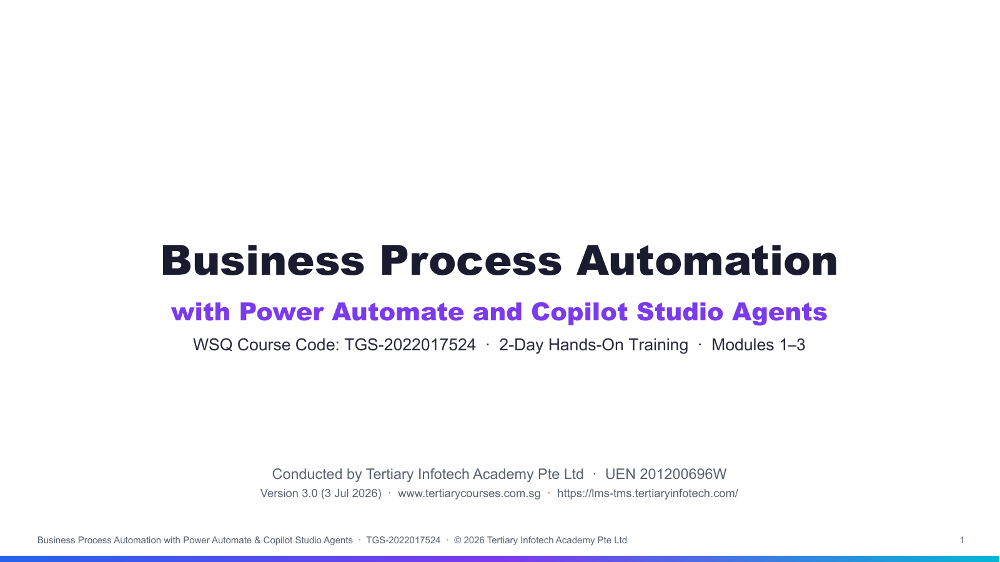

# Business Process Automation with Power Automate and Copilot Studio Agents

[](https://www.tertiarycourses.com.sg/)
[](https://www.skillsfuture.gov.sg/)
[]()
[]()

This repository contains hands-on lab materials for the **Business Process Automation with Power Automate and Copilot Studio Agents** course. Learn to automate real business processes — sales, finance, procurement, and order processing — by combining **Power Automate** flows with AI **agents** built in **Microsoft Copilot Studio**.

The course is **practical and step-by-step**: every lab is written so a complete beginner can follow along, starting from creating your account through to building full end-to-end automated workflows.

## Screenshot



## Course Overview

| Aspect | Details |
|--------|---------|
| **Course Code** | TGS-2022017524 (WSQ) |
| **Duration** | 2 Days (9:00 AM – 6:00 PM) |
| **Mode** | Physical / Zoom / On-site Corporate |
| **Level** | Beginner to Intermediate |
| **Assessment** | Day 2, 4:00–6:00 PM — Written Assessment (1 hr) + Practical Performance (1 hr), open book |
| **Certification** | WSQ Statement of Attainment |
| **Prerequisites** | Basic Microsoft 365 familiarity (Outlook, Excel). No coding required. |

## Learning Outcomes

Upon completion, you will be able to:

- Explain business workflow automation and the difference between standalone agents and integrated workflows
- Identify workflow logic components: triggers, actions, outputs, and steps
- Build Power Automate flows that send emails, log data to Excel, and run approvals
- Create practical business agents in Copilot Studio and design prompts for structured outputs
- Connect agents to Power Automate flows and pass outputs between them
- Combine agents and flows into complete end-to-end business automations (e.g. procurement request handling)

---

## Course Structure

### Day 1 — Foundations & Power Automate

Understand workflow automation concepts and build your first automated flows.

| Lab | Title | Description |
|-----|-------|-------------|
| **Lab 0** | [Environment Setup](labs/Day%201/Lab%200%20-%20Environment%20Setup/index.md) | Create your Microsoft 365, Copilot Studio, and Power Automate accounts step by step |
| **Module 1** | [Workflow Automation Concepts](labs/Day%201/Module%201%20-%20Workflow%20Automation%20Concepts.md) | Triggers, actions, outputs, steps; standalone agents vs integrated workflows |
| **Module 2** | [Introduction to Power Automate](labs/Day%201/Module%202%20-%20Introduction%20to%20Power%20Automate.md) | Power Automate overview; flow types, common triggers, actions, connections |
| **Lab 1** | [Instant Email Flow with a Prompt](labs/Day%201/Lab%201%20-%20Instant%20Email%20Flow/index.md) | Describe an instant email workflow, review the generated draft, correct it and test it |
| **Lab 2** | [Instant Excel Data Logging Flow](labs/Day%201/Lab%202%20-%20Instant%20Excel%20Logging%20Flow/index.md) | Add inputs and log each on-demand test record into an Excel table |
| **Lab 3** | [Scheduled Flow](labs/Day%201/Lab%203%20-%20Scheduled%20Flow/index.md) | Run a reminder automatically on a Recurrence timetable |
| **Lab 4** | [Automated Form Flow](labs/Day%201/Lab%204%20-%20Automated%20Form%20Flow/index.md) | Trigger from Microsoft Forms, email the team and log the submission to Excel |
| **Lab 5** | [Human-in-the-Loop Approval Flow](labs/Day%201/Lab%205%20-%20Human%20Approval%20Flow/index.md) | Pause for a manager decision, branch on the outcome and notify the requester |
| **Lab 6A** | [External Enquiry Webhook](labs/Day%201/Lab%206A%20-%20External%20Enquiry%20Webhook/index.md) | Use a Power Automate production URL to trigger a flow from the supplied external enquiry page |
| **Lab 6B** | [Webhook Chatbot](labs/Day%201/Lab%206B%20-%20Webhook%20Chatbot/index.md) | Send browser chat messages to a Power Automate webhook and display its JSON replies |

### Day 2 — Building Business Agents with Copilot Studio & Assessment

Create AI agents that understand requests and feed structured data into your flows, then sit the WSQ assessment (4:00–6:00 PM).

| Lab | Title | Description |
|-----|-------|-------------|
| **Module 3** | [Business Agents Concepts](labs/Day%202/Module%203%20-%20Business%20Agents%20Concepts.md) | Prompt design for structured outputs; connecting agents to flows |
| **Lab 7A** | [Create the IT Support Agent](labs/Day%202/Lab%207A%20-%20Create%20IT%20Support%20Agent/index.md) | Prompt-create the agent, review its Instructions and safety boundaries, then test and improve it |
| **Lab 7B** | [Ground and Evaluate the IT Support RAG Agent](labs/Day%202/Lab%207B%20-%20IT%20Support%20RAG%20Agent/index.md) | Upgrade the same agent with approved FAQ Knowledge, citations, evaluation and safe publishing |
| **Lab 8** | [Deploy the Agent to Teams and a Website](labs/Day%202/Lab%208%20-%20Deploy%20Agent%20to%20Teams%20and%20Website/index.md) | Publish the shared Marina Trust agent to Teams and connect the supplied website to an ordinary HTTP flow |
| **Lab 9** | [Teams and Website Enquiry Agent Flow](labs/Day%202/Lab%209%20-%20Banking%20Onboarding%20Agent%20Flow/index.md) | Use the agent in Teams and on a website; both channels trigger a deterministic agent flow and display its returned result |
| **Lab 10** | [Teams and Website Enquiry Prompt Flow](labs/Day%202/Lab%2010%20-%20Procurement%20Request%20Workflow/index.md) | Use the agent in Teams and on a website; both channels trigger an AI Builder prompt flow with guardrails |

### Workplace storyline

The labs use three connected workplace simulations rather than isolated feature
demos:

| Project | Labs | Real-world role and outcome |
|---|---|---|
| **ACME Customer Operations** | 0–6B | A customer-operations team acknowledges, records, schedules, approves and exposes enquiry services through forms and secure HTTP endpoints |
| **MyCompany IT Service Desk** | 7A–7B | An IT service manager creates a first-line support agent and grounds it with an approved operating FAQ |
| **Marina Trust Digital Onboarding** | 8–10 | A bank deploys an omnichannel onboarding assistant, first with deterministic rules and then with a guarded AI prompt |

Every lab states the learner's workplace role, the operational problem, a
realistic test record, the service outcome and the evidence a supervisor would
review.

---

## Repository Structure

```
TGS-2022017524/
├── README.md
├── LEARNER-GUIDE.md                        # full step-by-step learner guide (Markdown)
├── labs/                                   # all hands-on lab content
│   ├── Day 1/                              # Foundations & Power Automate
│   │   ├── Lab 0 - Environment Setup/
│   │   ├── Module 1 - Workflow Automation Concepts.md
│   │   ├── Module 2 - Introduction to Power Automate.md
│   │   ├── Lab 1 - Instant Email Flow/
│   │   ├── Lab 2 - Instant Excel Logging Flow/
│   │   ├── Lab 3 - Scheduled Flow/
│   │   ├── Lab 4 - Automated Form Flow/
│   │   ├── Lab 5 - Human Approval Flow/
│   │   ├── Lab 6A - External Enquiry Webhook/
│   │   └── Lab 6B - Webhook Chatbot/
│   └── Day 2/                              # Business Agents with Copilot Studio
│   │   ├── Module 3 - Business Agents Concepts.md
│   │   ├── Lab 7A - Create IT Support Agent/
│   │   ├── Lab 7B - IT Support RAG Agent/
│   │   ├── Lab 8 - Deploy Agent to Teams and Website/
│   │   ├── Lab 9 - Banking Onboarding Agent Flow/
│   │   └── Lab 10 - Procurement Request Workflow/
├── courseware/                             # Ready-to-deliver materials (PPTX/DOCX/PDF only)
│   ├── Business Process Automation with Power Automate and Copilot Studio Agents-v3.pptx / .pdf      # Slide deck (86 slides, WSQ)
│   ├── LG-<course>.docx / .pdf              # Learner Guide (Word) — generated
│   └── LP-<course>.docx / .pdf              # Lesson Plan (Word) — generated
├── .claude/skills/                         # Course build scripts live in the skills
│   ├── wsq-learner-guide/build_learner_guide.py   # Single-source generator (MD + DOCX)
│   ├── wsq-lesson-plan/build_lesson_plan.py       # Lesson-plan generator
│   └── course-slides/revise_deck.py               # One-time WSQ deck revision script
├── references/                             # Reference material
│   ├── labs/                               # Copilot Studio agents lab notes (PL-7008 style)
│   ├── Day 1/ · Day 2/                     # Previous 2-day chatbot course (reference)
│   └── PL-7008/                            # Microsoft PL-7008 course slides (PDF)
```

---

## Courseware

The `courseware/` folder holds the ready-to-deliver materials, and a full participant guide lives at the repo root:

| Material | File | For |
|----------|------|-----|
| **Learner Guide (Markdown)** | [LEARNER-GUIDE.md](LEARNER-GUIDE.md) | Participants — every lab, click-by-click |
| **Learner Guide (Word)** | `courseware/LG-<course>.docx` | Print / distribute |
| **Lesson Plan (Word)** | `courseware/LP-<course>.docx` | Facilitator — 2-day schedule |
| **Slide Deck** | `courseware/Business Process Automation with Power Automate and Copilot Studio Agents-v3.pptx` | Facilitator — 86 slides |
| **Written Assessment (WA/SAQ)** | `assessemnt/WA (SAQ) - <course>.docx` (+ answer key) | Open-ended knowledge assessment (6 questions) — confidential, not in the repo |
| **Practical Performance (PP)** | `assessemnt/PP Assessment - <course>.docx` (+ answer key) | Practical assessment (3 lab-based tasks) — confidential, not in the repo |

> The learner guide and lesson plan are **generated from a single source** (the lab markdown). After editing any lab, re-run `python3 .claude/skills/wsq-learner-guide/build_learner_guide.py` and `python3 .claude/skills/wsq-lesson-plan/build_lesson_plan.py` to keep them in sync.
>
> **PDFs** (`Business Process Automation with Power Automate and Copilot Studio Agents-v3.pdf`, `LG-….pdf`, `LP-….pdf`) are generated from the PPTX/DOCX via LibreOffice and are committed for convenience.
>
> **Assessments** (WA + PP question papers, answer keys, and their generator) are **confidential** and are not included in this repository.

---

## Prerequisites

Before starting, you need a Microsoft account with access to Power Platform. **Lab 0 walks you through getting everything for free.** In summary you will need:

- [ ] A Microsoft 365 account (a work/school account, or a free Microsoft 365 Business trial — see Lab 0)
- [ ] Access to [Power Automate](https://make.powerautomate.com)
- [ ] Access to [Copilot Studio](https://copilotstudio.microsoft.com)
- [ ] Outlook (email) and Excel (via OneDrive/SharePoint) — included with Microsoft 365
- [ ] A modern web browser (Microsoft Edge or Google Chrome recommended)

> **No prior coding or automation experience is required.** Every step is described in detail.

---

## How to Use These Labs

1. Start with **Lab 0** to set up your accounts — do this before the course if possible.
2. Work through the labs **in order**; each builds on skills from the previous one.
3. Read the **Module** concept pages at the start of each day for the "why" behind the labs.
4. Use **Labs 8–10** as a connected progression: Teams agent plus external website flow, Teams/website agent flow, and Teams/website prompt flow. Then adapt one pattern to a workflow relevant to your own job.

### Import the ready-made Power Automate flows

Use the ready-made packages as the default classroom path. Download
[Power-Automate-Lab-Import-Packages.zip](labs/Power-Automate-Lab-Import-Packages.zip)
for all portable Power Automate flows, the Lab 8 website flow and the
lab-specific solutions for Labs 9–10. A Day 1-only bundle is also available at
[00-Power-Automate-Lab-Import-Packages.zip](labs/Day%201/00-Power-Automate-Lab-Import-Packages.zip).
Extract the outer bundle first. Import the Lab 1–8 ZIPs through **Power
Automate → My flows → Import → Import Package (Legacy)**. Import
the Lab 9 and Lab 10 `*-Solution.zip` files through **Power Automate →
Solutions → Import solution**. See the
[package guide and compatibility matrix](labs/IMPORT-PACKAGES.md) before
importing. Connections and tenant-owned Forms/Excel resources must still be
selected by each student; passwords and tenant resource IDs are intentionally
never embedded.

The Lab 9 solution includes the connector-free deterministic decision flow.
The Lab 10 solution includes a runnable safe fallback that learners can replace
with their own AI Builder prompt. Knowledge, permissions, connector sign-in and
publishing remain inside each learner's environment.

---

## Key Resources

- [Power Automate Documentation](https://learn.microsoft.com/power-automate/)
- [Microsoft Copilot Studio Documentation](https://learn.microsoft.com/microsoft-copilot-studio/)
- [Microsoft 365 Developer Program](https://developer.microsoft.com/microsoft-365/dev-program)
- [Power Automate Templates Gallery](https://make.powerautomate.com/templates/)
- [Copilot Studio Licensing](https://learn.microsoft.com/microsoft-copilot-studio/billing-licensing)

---

## Course Information

**Provider**: [Tertiary Courses](https://www.tertiarycourses.com.sg/)

**Funding Available**:
- SkillsFuture Credit (SFC)
- SkillsFuture Enterprise Credit (SFEC)
- Post-Secondary Education Account (PSEA)

---

## License

This repository contains lab materials intended for educational purposes.

## Acknowledgments

- Microsoft Power Automate and Copilot Studio teams for the platform and documentation
- [Tertiary Courses](https://www.tertiarycourses.com.sg/) for course facilitation
