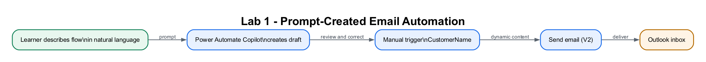

# Lab 1: Create Your First Flow with a Prompt

## Lab Title
Create and Verify an Instant Email Flow with Power Automate Copilot

## Lab Objectives
By the end of this lab, you will be able to:
1. Describe a business automation in natural language
2. Ask Power Automate Copilot to generate the first version of the flow
3. Review the suggested **trigger**, **action**, connections and field values
4. Correct the flow in the designer instead of assuming AI output is complete
5. Use **dynamic content** to personalise the email
6. **Save**, **Test → Run**, and use the **run history** to verify the result

## Prerequisites
- Completed [Lab 0](../Lab%200%20-%20Environment%20Setup/index.md) (accounts ready)
- Signed in at <a href="https://make.powerautomate.com" target="_blank" rel="noopener">https://make.powerautomate.com</a> with **Course Sandbox** selected (top-right)
- Outlook working with your account (a mailbox-enabled account)

## Workflow Visual



The Copilot prompt creates a draft; the learner verifies the trigger, dynamic
content and Outlook action before testing.

## Choose Your Route

- **Part 1 — Build step by step:** recommended for learning how Copilot creates
  a draft and how to verify it.
- **Part 2 — Import the packaged flow:** use the ZIP in this lab folder for a
  faster start or recovery.

Download [Lab1-Send-Confirmation-Email.zip](Lab1-Send-Confirmation-Email.zip), then use **My flows → Import → Import Package (Legacy)**. Map the Outlook connection and follow the [import details](#part-2--import-the-packaged-flow).
Use this only when Copilot is unavailable or you need a known-good recovery flow. The main learning route below begins with a natural-language prompt.

## Scenario
You are an **ACME Customer Service Officer** handling enquiries received by
telephone and at the service counter. During a call, you press **Run**, enter the
customer's name and send an acknowledgement immediately. The email sets a
one-business-day response expectation and gives the customer confidence that
the request was captured.

| Workplace detail | Requirement |
|---|---|
| Trigger | A staff member deliberately runs the flow after verifying the caller's name |
| Recipient | The controlled training mailbox standing in for the customer |
| Service target | Acknowledgement sent within 15 minutes of first contact |
| Evidence | Successful run history plus the personalised email received |

Instead of assembling the first version card by card, you describe the
requirement to Copilot and then inspect every generated field. This establishes
the course pattern:

**Describe → Generate → Review → Test → Improve**

---

## Part 1 — Build the Flow Step by Step

### Step 1: Generate the first draft with Copilot (~7 minutes)

1. Go to **<a href="https://make.powerautomate.com" target="_blank" rel="noopener">https://make.powerautomate.com</a>** and sign in.
2. Confirm the **Environment selector** (top-right) shows **Course Sandbox** — the environment from Lab 0.
3. On **Home** or **Create**, find **Create your automation with Copilot** or **Describe it to design it**. The wording varies slightly between the new and classic navigation.
4. Paste this prompt, replacing the email placeholder with your own mailbox-enabled course address:

   ```text
   Create an instant cloud flow named Lab 1 - Send Confirmation Email.
   Start it with Manually trigger a flow and ask for a text input named
   CustomerName. Then use Office 365 Outlook Send an email (V2) to
   YOUR_EMAIL@YOUR_TENANT. Use the subject Thank you for your enquiry.
   The body should greet the CustomerName and say that ACME Customer
   Operations has logged the enquiry and will respond within 1 business day.
   ```

5. Submit the prompt. Read the proposed structure; it should contain **Manually trigger a flow → Send an email (V2)**.
6. If the proposed trigger or action is wrong, add this refinement:

   ```text
   Use only Manually trigger a flow and Office 365 Outlook Send an email
   (V2). Do not use Gmail, Outlook.com, Teams, or an automated trigger.
   ```

7. Select **Keep it and continue**. Check that the Outlook connection has a green check, sign in if required, then select **Create flow**.

> **Important:** Copilot creates a draft, not proof that the automation is correct. The next step is compulsory: inspect every generated card and value.

> **Can't see the Copilot prompt box?** Your tenant, region or licence may not expose natural-language flow creation. Use **Create → Instant cloud flow**, name it `Lab 1 - Send Confirmation Email`, select **Manually trigger a flow**, and continue below. Alternatively use the recovery import package.

### Step 2: Review and correct the generated flow (~8 minutes)

1. Rename the flow to `Lab 1 - Send Confirmation Email` if Copilot used a different name.
2. Confirm the first card is **Manually trigger a flow**.
3. Open the trigger. Confirm it contains one **Text** input named `CustomerName`.
4. If the input is missing, select **+ Add an input → Text**, then name it `CustomerName`.
5. Confirm the next card is **Send an email (V2)** from **Office 365 Outlook**. Delete and replace it if Copilot selected Gmail, Outlook.com or another connector.

> **Tip:** This input becomes one of the trigger's **outputs** — a piece of data you can drop into later steps using dynamic content.

### Step 3: Verify and complete the email action (~10 minutes)

If Copilot did not add an email action, select the **+** below the trigger, choose **Add an action**, search for **Send an email**, and select **Office 365 Outlook → Send an email (V2)**.

   > **⚠️ Warning:** Pick **Office 365 Outlook**, not Gmail, Outlook.com, or SMTP. Only Office 365 Outlook uses your course work account.

1. If required, select **Sign in**, choose your course account, and approve the Outlook connection. A green ✓ means it is ready.
2. Open the generated email action and verify every field. Do not keep a value merely because Copilot supplied it.
3. Configure the email fields using the copy-paste blocks below.

   - **To:** type your own email address, then press **Enter** so it resolves into a **chip** (a small pill with an × next to it). If it stays as plain text, the address wasn't accepted — retype it.
   - **Subject:** copy-paste this line:

     ```text
     Thank you for your enquiry
     ```

   - **Body:** build the message in three parts — paste, insert token, paste:
     1. Click inside the **Body** field, paste this text, and then type one **space**:

        ```text
        Hi
        ```

     2. Select the **dynamic content** icon (the small lightning bolt) that appears in/next to the field.
     3. From the list, under **Manually trigger a flow**, choose **CustomerName**. It appears as a coloured **token** (chip) in the field.
     4. Click just after the token and paste the rest:

        ```text
        , thank you for contacting ACME Customer Operations. Your enquiry has been logged and a service officer will respond within 1 business day.
        ```

> **Tip:** **Dynamic content** is how outputs from earlier steps get reused. The coloured `CustomerName` token is a placeholder — it's replaced with the real value when the flow runs.

> **⚠️ Warning — paste as plain text.** If you copy from a PDF or Word version of this guide, formatting (smart quotes “ ”, curly apostrophes, hidden line breaks) can come along and appear literally in the email. Paste with **Ctrl+Shift+V** (Mac: **Cmd+Shift+V**) to strip formatting, or copy from the Markdown code boxes above, which contain plain text only. Never copy backticks (`` ` ``) into a field.

> **✅ Check before saving:** To shows a **chip**, Subject is plain text, Body reads `Hi [CustomerName-token], thank you for reaching out…` with exactly one coloured token. If `CustomerName` appears as plain black text instead of a token, delete it and re-insert from the dynamic content list.

### Step 4: Save and test (~5 minutes)
1. Select **Save** (top-right).

   > **Tip:** There is **no separate "Send" button**. Running the flow *is* what sends the email — the *Send an email* action does the work. So the routine is always: **Save**, then **Test → Run flow**.

2. Select **Test** (top-right) → choose **Manually** → **Test** → **Run flow**.
3. Power Automate prompts for the input you defined:
   - **CustomerName:** type `Jane Tan`
4. Select **Run flow**, then **Done**.
5. Watch the run status — each step should show a **green check**.
6. Open **Outlook** and confirm the email arrived, personalized as "Hi Jane Tan".

### Step 5: Review the run history (~5 minutes)
1. In the left menu, select **My flows**, then open **Lab 1 - Send Confirmation Email**.
2. Look at the **28-day run history** — you'll see your test run with a status.
3. Select the run to inspect each step's **inputs and outputs**. This is how you debug flows: a **green check** = success; a **red ⚠️** = error (click it to read the message).

---

## Part 2 — Import the Packaged Flow
If you get stuck, use either of these packages:

- **Legacy flow package:** [Lab1-Send-Confirmation-Email.zip](Lab1-Send-Confirmation-Email.zip) for **My flows → Import → Import Package (Legacy)**.
- **Dataverse solution:** [Lab1-Send-Confirmation-Email-Solution.zip](Lab1-Send-Confirmation-Email-Solution.zip) for **Solutions → Import solution**.

For the solution route:

1. Confirm the **Environment selector** (top-right) shows **NUS Copilot Sandbox**.
2. In the left menu, select **Solutions** → **Import solution** (toolbar).
3. **Browse** → choose the ZIP → **Next**.
4. On the **Connections** page, the **Office 365 Outlook** connection reference asks for a connection — pick an existing one or **+ New connection** (sign in with your course account), then **Import**.
5. When the import completes, open the solution **Lab 1 - Send Confirmation Email** → open the flow → **Edit**, change the **To** address to your own email, and **Save**. Turn the flow **On** if it shows as Off.
6. Continue from [Step 4: Save and test](#step-4-save-and-test-5-minutes).

> **Tip:** Importing gives you a known-good flow definition — if the imported flow *still* fails, the problem is your **connection/account** (see Troubleshooting), not the flow.

> **Note:** After a legacy import, open the flow, reconnect Outlook, replace
> `YOUR_EMAIL@YOUR_TENANT` with your email, then save and test. If your tenant
> says flows must be created in Dataverse solutions, use the solution package.

---

## Checkpoint
> **Workplace evidence:** Retain the successful run-history screen and the received acknowledgement email. A supervisor should be able to match the input customer name to the message that was delivered.

You should now have:
- ✅ A flow named **Lab 1 - Send Confirmation Email** with a `CustomerName` text input
- ✅ An Office 365 Outlook connection showing a green ✓
- ✅ A successful test run (all steps green)
- ✅ A personalized email received in Outlook reading "Hi Jane Tan, …"

## Troubleshooting
| Problem | Solution |
|---------|----------|
| No "Send an email (V2)" action listed | Make sure you selected the **Office 365 Outlook** connector (not Gmail / Outlook.com / SMTP). |
| Action fails with **"Unauthorized"** | The Office 365 Outlook connection is broken/expired, **or** the signed-in account has **no mailbox**. Open the action's connection, **reconnect** with a mailbox-enabled account (green ✓). |
| **BadRequest — "content was not a valid JSON … parsing value: R"** | The connection account has **no Exchange Online mailbox** (Exchange replies with plain text like "REST API is not yet supported for this mailbox", which starts with "R"). Verify by signing in at outlook.office.com with that account. Fix: use a connection with a **mailbox-enabled account**, or ask the admin to assign an Exchange Online license. Re-editing the flow will not fix this. |
| Connection shows a red ⚠️ | The connection needs to be re-authorized — select it and **reconnect** / sign in again. |
| Email not received | Check Junk/Spam; confirm the **To** address; re-run the test. |
| Can't find dynamic content | Click directly **inside** the Body field first, then open the lightning-bolt menu. |
| `CustomerName` shows as plain text, not a token | Delete it and re-insert it from the dynamic content list so it becomes a coloured token. |
| Clicked "Save" but no email arrived | Saving does not send. You must **Test → Run flow** — running the flow performs the action. |

## Key Takeaways
- A clear prompt states the trigger, connector, action, inputs and expected output.
- Copilot accelerates the first draft; the maker remains responsible for reviewing connections, fields, dynamic content and behaviour.
- Every flow follows the pattern **Trigger → Actions**.
- Trigger **inputs** become **outputs** that you reuse in later steps via **dynamic content** tokens.
- A connector needs a **connection**: green ✓ = ready, red ⚠️ = reconnect. **"Unauthorized"** on *Send an email* means the Outlook connection is broken or the account has no mailbox.
- There is **no separate Send button** — **Save**, then **Test → Run** to make the actions happen.
- **Test** + **run history** are your tools for verifying and debugging.

## Duration
~30 minutes

## Next Steps
Proceed to [Lab 2: Instant Excel Logging Flow](../Lab%202%20-%20Instant%20Excel%20Logging%20Flow/index.md).
