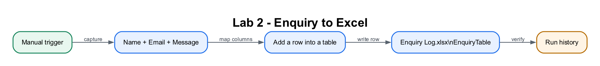

# Lab 2: Instant Excel Logging Flow

## Lab Title
Capture Form Data and Log It into Excel with Power Automate

## Lab Objectives
By the end of this lab, you will be able to:
1. Prepare an Excel workbook with a formatted **Table** in OneDrive
2. Build a flow with a **manual trigger** that collects Name, Email, and Message
3. Add an **Add a row into a table** (Excel) action and connect to your workbook
4. Map trigger outputs into Excel columns and stamp the date using an **fx expression**
5. **Save**, then **Test → Run** and verify each submission appears as a new row
6. Understand how to swap the manual trigger for a real Microsoft Forms trigger

## Prerequisites
- Completed [Lab 1](../Lab%201%20-%20Instant%20Email%20Flow/index.md)
- Access to Excel via OneDrive (verified in Lab 0)
- Signed in at <a href="https://make.powerautomate.com" target="_blank" rel="noopener">https://make.powerautomate.com</a> with **Course Sandbox** selected (top-right)

## Workflow Visual



Each trigger input maps to one named column in the Excel table.

## Choose Your Route

- **Part 1 — Build step by step:** recommended for learning Excel table mapping.
- **Part 2 — Import the packaged flow:** use the ZIP in this lab folder, then
  select your own workbook and table.

Download [Lab2-Log-Enquiry-to-Excel.zip](Lab2-Log-Enquiry-to-Excel.zip), then
use **My flows → Import → Import Package (Legacy)**. Map the Excel connection
and follow the [import details](#part-2--import-the-packaged-flow).
You only need to select your own workbook and table after import.

## Scenario
You are the **ACME Customer Operations Coordinator**. Phone calls and
walk-in enquiries currently live in personal notebooks, so supervisors cannot
see workload or prove that a customer was followed up. You will create a shared
enquiry register and an instant flow that writes one traceable row for every
contact.

| Workplace detail | Requirement |
|---|---|
| Users | Customer-service officers |
| System of record for this pilot | OneDrive Excel table named `EnquiryTable` |
| Minimum audit data | Timestamp, customer name, contact email, request and status |
| Success measure | Every test run adds exactly one complete row with status `New` |

**Production extension:** Replace Excel with Dataverse or a CRM when concurrent
users, permissions, retention rules and reporting become important.

---

## Part 1 — Build the Flow Step by Step

### Step 1: Create the Enquiry Log workbook with a Table (~10 minutes)
Power Automate can only read and write Excel data that is formatted as a **Table** — not loose cells.

1. Go to **<a href="https://office.com" target="_blank" rel="noopener">https://office.com</a>**, open **Excel**, and create a **New blank workbook**.
2. Rename it (click the file name at the top of the screen): `Enquiry Log`. It saves automatically to **OneDrive**.
3. In **row 1**, type these five column headers, one per cell (headers must be in row 1):
   - A1: `Date`
   - B1: `Name`
   - C1: `Email`
   - D1: `Message`
   - E1: `Status`
4. Select the header range **A1:E1**.
5. On the ribbon, select **Insert → Table**.
6. In the **Create Table** dialog, tick **My table has headers**, then select **OK**.
7. With the table selected, open the **Table Design** tab and set **Table Name** to `EnquiryTable`. This makes it easy to find in Power Automate.
8. Close the Excel tab — changes are saved to OneDrive automatically.

> **⚠️ Warning:** If you skip **Insert → Table**, your file will have data but **no Table**, and Power Automate's "Table" dropdown will be empty in Step 3. The Table is mandatory.

> **Tip:** Naming the table `EnquiryTable` is optional but strongly recommended — otherwise it appears as `Table1` and is harder to pick out later.

### Step 2: Create the flow and trigger (~5 minutes)
We'll use a manual trigger with inputs to *simulate* a submitted form. (Microsoft Forms uses the same downstream pattern — see Step 5.)

1. Go to **<a href="https://make.powerautomate.com" target="_blank" rel="noopener">https://make.powerautomate.com</a>**, confirm **Course Sandbox** is selected top-right, then select **Create → Instant cloud flow**.
2. **Flow name:** `Lab 2 - Log Enquiry to Excel`
3. **Choose how to trigger this flow:** select **Manually trigger a flow**, then **Create**.
4. Select the trigger card to open its panel, then select **+ Add an input** three times, choosing **Text** each time, and name them:
   - `Name`
   - `Email`
   - `Message`

### Step 3: Add the "Add a row into a table" action (~10 minutes)
1. Below the trigger, select the **+** (plus) button, then **Add an action**.
2. In the search box, type **Add a row into a table**.
3. Select the **Excel Online (Business)** connector → action **Add a row into a table**.
4. If prompted, **Sign in** to create the connection (green ✓ = ready).
5. Configure where your file lives:
   - **Location:** `OneDrive for Business`
   - **Document Library:** `OneDrive`
   - **File:** browse to and select **Enquiry Log.xlsx**
   - **Table:** select **EnquiryTable**
6. The action now shows one field per column. Fill them in:
   - **Date:** this must be an **expression**, not typed text. Click the **Date** field, then select the **fx** (Expression) editor. Type exactly:

     ```
     formatDateTime(utcNow(),'yyyy-MM-dd HH:mm')
     ```

     Then select **Add** / **OK**. The value should appear in the field as a single **coloured token** (chip).
   - **Name:** click the field → dynamic content → choose **Name**
   - **Email:** click the field → dynamic content → choose **Email**
   - **Message:** click the field → dynamic content → choose **Message**
   - **Status:** type the static text `New`

> **⚠️ Warning — fx, not typing.** The `formatDateTime(...)` expression **must** be entered through the **fx / Expression** editor so it becomes a coloured token. If you just type it into the Date field, Power Automate logs the literal text `formatDateTime(utcNow(),'yyyy-MM-dd HH:mm')` into the cell instead of the actual date.

> **Tip — UTC vs local time.** `utcNow()` returns the time in **UTC**, so a 4pm Singapore enquiry logs as 08:00. If you want Singapore local time, use this expression in the **fx** editor instead:
> ```
> convertTimeZone(utcNow(),'UTC','Singapore Standard Time','yyyy-MM-dd HH:mm')
> ```

### Step 4: Save and test (~10 minutes)
1. Select **Save** (top-right).

   > **Tip:** As in Lab 1, there's **no separate "submit" button** — running the flow *is* what writes the row. Always **Save**, then **Test → Run flow**.

2. Select **Test → Manually → Test → Run flow**.
3. Enter sample values when prompted:
   - **Name:** `Ahmad Rahman`
   - **Email:** `ahmad@example.com`
   - **Message:** `I need the document checklist for opening an SME current account.`
4. Select **Run flow** → **Done**. Confirm every step shows a **green check**.
5. Open **Enquiry Log.xlsx** in Excel — a **new row** should appear with your values, a `New` status, and a timestamp in the Date column.
6. Run the test **2–3 more times** with different values to confirm each submission adds another row.

### Step 5: (Optional) Connect it to a real Microsoft Form (~5 minutes)
To turn this into a true *form submission* workflow:
1. Create a form at **<a href="https://forms.office.com" target="_blank" rel="noopener">https://forms.office.com</a>** with three questions: Name, Email, Message.
2. Build a **new** flow with the trigger **When a new response is submitted** (Microsoft Forms connector).
3. Add the **Get response details** action, then the same **Add a row into a table** action, mapping the Forms answers into the columns (and keep the same `formatDateTime(...)` fx expression for Date).

> **Tip:** This shows the power of triggers — swap the manual trigger for a Forms trigger and the *same* logging logic runs automatically on every real submission.

---

## Part 2 — Import the Packaged Flow

Download [Lab2-Log-Enquiry-to-Excel.zip](Lab2-Log-Enquiry-to-Excel.zip), then use
**My flows → Import → Import Package (Legacy)**. After import, open the Excel
action and reselect your own `Enquiry Log.xlsx` file and `EnquiryTable`; these
tenant-owned resources cannot be stored in a reusable package.

---

## Checkpoint
> **Workplace evidence:** Show one successful flow run beside the matching Excel row, including timestamp, customer details and `New` status. This demonstrates traceability from request to register.

You should now have:
- ✅ `Enquiry Log.xlsx` in OneDrive with a Table named **EnquiryTable** (headers Date, Name, Email, Message, Status in row 1)
- ✅ A flow named **Lab 2 - Log Enquiry to Excel** with Name/Email/Message text inputs
- ✅ A **Date** column populated by the `formatDateTime(...)` **fx** expression (a coloured token, not literal text)
- ✅ Several test rows logged, each with a timestamp and Status `New`

## Troubleshooting
| Problem | Solution |
|---------|----------|
| File or Table not listed in the action | Ensure the data is formatted as a **Table** (Insert → Table), saved in **OneDrive**, with headers in row 1. |
| Date cell shows the literal text `formatDateTime(utcNow(),...)` | You typed the expression instead of using **fx**. Delete it, click the **fx / Expression** editor, paste the expression, and confirm it becomes a coloured token. |
| Date cell shows **`########`** | This is **not** an error — the column is just too narrow. **Auto-fit** the column (double-click its right border) to see the value. |
| Times look wrong / off by hours | `utcNow()` is **UTC**. Use the `convertTimeZone(...,'Singapore Standard Time',...)` expression for local time. |
| Row added but Name/Email/Message blank | Re-map each column to the correct dynamic content token. |
| Stray backtick or quote appears in a cell | Don't paste characters from this guide. Type values yourself or use the fx editor. |
| Connection shows red ⚠️ | Re-authorize the **Excel Online (Business)** connection (sign in again) until it shows a green ✓. |
| Saved but no row appeared | Saving doesn't write rows. You must **Test → Run flow** — running performs the action. |

## Key Takeaways
- Power Automate reads/writes Excel **Tables** (Insert → Table), never loose cells.
- The **Date** must be entered via the **fx** editor so `formatDateTime(...)` becomes a token — typing it logs the literal text.
- `utcNow()` is **UTC**; use `convertTimeZone(...)` for Singapore local time.
- `########` in a cell means the column is too narrow — auto-fit it; it's not an error.
- The same logging action works behind **any** trigger — manual, Microsoft Forms, email, or a Copilot Studio agent.

## Duration
~35 minutes

## Next Steps
Proceed to [Lab 3: Scheduled Flow](../Lab%203%20-%20Scheduled%20Flow/index.md).
