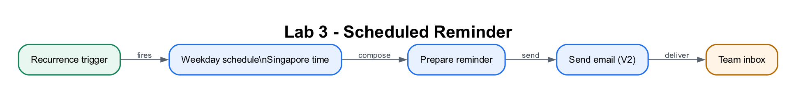

# Lab 3: Scheduled Flow

## Lab Title
Build a Scheduled (Recurring) Workflow with Power Automate

## Lab Objectives
By the end of this lab, you will be able to:
1. Create a **Scheduled cloud flow** that uses the **Recurrence** trigger
2. Configure the Interval, Frequency, **Time zone**, hours, and specific days
3. Send a **daily reminder email** automatically on a timetable
4. **Test/Run now** without waiting for the scheduled time
5. (Optional stretch) Read the Excel **EnquiryTable** and include a live **count** in the email

## Prerequisites
- Completed [Lab 1](../Lab%201%20-%20Instant%20Email%20Flow/index.md) (Send an email)
- *(For the optional stretch)* An Excel **Enquiry Log** workbook with table **EnquiryTable** from [Lab 2](../Lab%202%20-%20Instant%20Excel%20Logging%20Flow/index.md)
- Signed in at **make.powerautomate.com** in the **Course Sandbox** environment

## Workflow Visual



The recurrence trigger starts the automation without a person submitting data.

## Choose Your Route

- **Part 1 — Build step by step:** recommended for learning recurrence rules.
- **Part 2 — Import the packaged flow:** use the ZIP in this lab folder, bind
  Outlook, set the recipient and verify the schedule.

Download [Lab3-Scheduled-Enquiry-Reminder.zip](Lab3-Scheduled-Enquiry-Reminder.zip),
then use **My flows → Import → Import Package (Legacy)**. Map the Outlook
connection and follow the [import details](#part-2--import-the-packaged-flow).
The recurrence and reminder action are already configured.

## Scenario
You are the **ACME Customer Operations Team Lead**. New enquiries must receive
a substantive reply within one business day, but records marked `New` are being
missed during busy periods. At **9:00 AM every weekday**, the team needs an
operational reminder to review the shared queue before customer calls begin.

| Workplace detail | Requirement |
|---|---|
| Process owner | Customer Operations Team Lead |
| Trigger | Weekdays at 9:00 AM Singapore time |
| Control | No weekend notification and no UTC timing error |
| Success measure | Reminder arrives with the queue review instruction; optional stretch includes the current row count |

In production, the reminder would be sent to a shared mailbox or Teams channel
and would count only rows whose `Status` is `New`, not every row.

> **Tip:** Trigger types so far — **instant/manual** (Labs 1–2, you press Run) and **scheduled** (this lab, runs by the clock). Lab 4 adds an **automated event** trigger (a form submission).

---

## Part 1 — Build the Flow Step by Step

### Step 1: Create a scheduled flow (~6 minutes)
1. Go to **<a href="https://make.powerautomate.com" target="_blank" rel="noopener">https://make.powerautomate.com</a>**.
2. Top-right, confirm the environment selector reads **Course Sandbox**. If not, click it and switch.
3. In the left menu, click **+ Create**.
4. Under "Start from blank", click **Scheduled cloud flow**.
5. In the dialog:
   - **Flow name:** `Lab 3 - Scheduled Enquiry Reminder`
   - **Starting:** today's date and any time
   - **Repeat every:** `1` and **Week**
6. Click **Create**. The designer opens with a **Recurrence** trigger already added.

### Step 2: Fine-tune the schedule (~10 minutes)
1. Click the **Recurrence** trigger card to open its configuration panel.
2. Set the basics:
   - **Interval:** `1`
   - **Frequency:** `Week`

   > **Tip:** Frequency must be **Week** (not Day) — the **On these days** option in the next step only appears with a weekly frequency.

3. Under **Advanced parameters**, select and set:
   - **Time Zone:** `(UTC+08:00) Kuala Lumpur, Singapore`
   - **On These Days:** tick **Monday, Tuesday, Wednesday, Thursday, Friday** (leave Saturday and Sunday unticked)
   - **At These Hours:** `9`
   - **At These Minutes:** `0`
4. The schedule now reads: **every weekday at 9:00 AM Singapore time**.

> **⚠️ Warning:** You MUST set the **Time zone**. Without it, the Recurrence trigger uses **UTC**, so a "9" would fire at 9:00 UTC = 5:00 PM Singapore — the wrong local time. This is the same UTC-vs-local trap from Lab 2.

### Step 3: Send the reminder email (~8 minutes)
1. Below the Recurrence trigger, click **+** → **Add an action**.
2. Search `send an email` and select **Send an email (V2)** (from **Office 365 Outlook**). Complete the connection if prompted (it must show a green check).
3. Configure:
   - **To:** your team's address (use your own mailbox for testing)
   - **Subject:** `Daily reminder: review new enquiries`
   - **Body:**
     ```
     Good morning,
     This is your daily reminder to review and follow up on new enquiries
     in the Enquiry Log. Please action any items marked "New".
     ```
4. Top-right, click **Save**.

> **⚠️ Warning:** If you hit an **Unauthorized** error, the Outlook connection is broken or the account has no mailbox. Reconnect **Office 365 Outlook** with a mailbox-enabled account (see [Lab 1](../Lab%201%20-%20Instant%20Email%20Flow/index.md)). The connection must show a green ✓ before running.

### Step 4: Test the flow now (~5 minutes)
You don't have to wait until 9 AM — you can run it on demand to check it works.
1. Top-right, click **Test** → **Manually** → **Test** → **Run flow** → **Done**.
2. Confirm every step shows a green check and the reminder email arrives in your inbox.
3. From now on the flow also runs **automatically** on its schedule.

> **Tip:** A scheduled flow only fires on its timetable in real life — **Test → Run flow** lets you verify it immediately instead of waiting for 9 AM tomorrow.

### Step 5 (Optional stretch): Include a live count from Excel (~15 minutes)
Make the reminder smarter by counting how many enquiries are logged in **EnquiryTable**.

1. **Above** the Send an email action, click **+** → **Add an action**.
2. Search `list rows` and select **List rows present in a table** (from **Excel Online (Business)**).
3. Configure the location:
   - **Location:** OneDrive for Business
   - **Document Library:** OneDrive
   - **File:** browse to **Enquiry Log** (the `.xlsx` workbook)
   - **Table:** `EnquiryTable`
4. Open the **Send an email (V2)** action again. Click into the **Body** where you want the count, then open the **fx** (expression) editor and enter exactly:
   ```
   length(outputs('List_rows_present_in_a_table')?['body/value'])
   ```
   - Click **Add / OK** so it becomes a **token** (highlighted chip), not plain text.
   - Example line: `There are currently ` *(token)* ` enquiries logged.`
5. Click **Save**, then **Test → Run flow** again. The email now shows the live record count.

> **⚠️ Warning:** The name inside `outputs('...')` must match your action's **internal name** exactly, with spaces replaced by underscores. If the expression errors, open the **List rows present in a table** action → **…** menu → check the action name, and adjust `List_rows_present_in_a_table` to match.

---

## Part 2 — Import the Packaged Flow

Download [Lab3-Scheduled-Enquiry-Reminder.zip](Lab3-Scheduled-Enquiry-Reminder.zip),
then use **My flows → Import → Import Package (Legacy)**. Reconnect Outlook,
replace `YOUR_EMAIL@YOUR_TENANT`, and confirm the recurrence uses **Singapore
Standard Time** before saving.

---

## Checkpoint
> **Workplace evidence:** Capture the weekday 9:00 AM recurrence settings and the resulting team reminder. The evidence should make the operating schedule and intended recipient unambiguous.

- ✅ A **scheduled** flow **Lab 3 - Scheduled Enquiry Reminder** using the **Recurrence** trigger
- ✅ Configured for **weekdays at 9:00 AM** with **Time zone (UTC+08:00) Kuala Lumpur, Singapore**
- ✅ A reminder email sent on a successful **Test → Run flow**
- ✅ *(Optional)* A live record count pulled from **EnquiryTable**

## Troubleshooting
| Problem | Solution |
|---------|----------|
| Email arrives at the wrong time | Set **Time Zone** in the Recurrence trigger's **Advanced parameters** (e.g. (UTC+08:00) Kuala Lumpur, Singapore). Without it the schedule uses UTC. |
| Flow runs every day including weekends | In **On These Days**, tick only **Monday–Friday**. |
| **On These Days** option is missing | Set **Frequency** to **Week** — the days-of-week option only appears with a weekly frequency. |
| Send email **Unauthorized** | Reconnect **Office 365 Outlook** with a mailbox-enabled account; the connection must show green ✓. |
| `length(...)` expression error | Match the name inside `outputs('...')` to the **List rows** action's actual internal name (spaces become underscores). |
| Don't want to wait for the schedule | Use **Test → Manually → Run flow** to run it immediately. |
| Count shows as literal text, not a number | The expression wasn't added via the **fx** editor as a token. Re-enter it through **fx** and confirm it becomes a highlighted chip. |

## Key Takeaways
- The **Recurrence** trigger runs flows automatically on a timetable — no human starts them.
- Always set the **Time zone** so schedules fire at the right local time, not UTC.
- Use **Test → Run flow** to verify a scheduled flow without waiting for its scheduled time.
- Scheduled flows are ideal for digests, reminders, and clean-up jobs.

## Duration
~30 minutes (45 with the optional stretch)

## Next Steps
Proceed to [Lab 4: Automated Form Flow](../Lab%204%20-%20Automated%20Form%20Flow/index.md).
