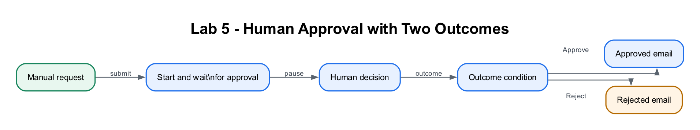

# Lab 5: Human-in-the-Loop Approval Flow

## Lab Title
Build a Simple Approval Workflow with Power Automate

## Lab Objectives
By the end of this lab, you will be able to:
1. Create an instant cloud flow with three manual trigger inputs (RequesterName, RequesterEmail, RequestDetails)
2. Add a **Start and wait for an approval** action and assign it to a real user in your tenant
3. Use a **Condition** to branch on the approval **Outcome** (Approved vs Rejected)
4. Send a different notification email in the **If yes** and **If no** branches
5. Test and verify both the Approve and Reject paths end-to-end

## Prerequisites
- Completed [Lab 4](../Lab%204%20-%20Automated%20Form%20Flow/index.md), including email and Excel actions
- Signed in at **make.powerautomate.com** in the **Course Sandbox** environment
- Your own signed-in account (it must exist in this tenant's directory) — you will be your own approver for testing

## Workflow Visual



The approval Outcome controls which notification branch runs.

## Choose Your Route

- **Part 1 — Build step by step:** recommended for learning approval branches.
- **Part 2 — Import the packaged flow:** use the ZIP in this lab folder, bind
  Approvals and Outlook, and select a real tenant user as approver.

Download [Lab5-Human-Approval.zip](Lab5-Human-Approval.zip), then use **My
flows → Import → Import Package (Legacy)**. Map the Approvals and Outlook
connections and follow the
[import details](#part-2--import-the-packaged-flow). Replace the
approver placeholder with your own tenant account.

## Scenario
You are an **ACME IT Operations Coordinator**. A service officer needs a
replacement laptop costing **SGD 1,850** after a hardware failure. Company
policy requires a manager to approve the purchase before procurement can act.
The workflow must pause for the named approver, preserve the decision and notify
the requester through the correct branch.

Use this realistic test request:

```text
RequesterName: Priya Nair
RequesterEmail: your training mailbox
RequestDetails: Replacement laptop for Customer Operations officer; asset ACME-LT-1042 failed diagnostics; quoted cost SGD 1,850.
```

Run both an **Approve** and a **Reject** test. A real deployment would also
capture amount, cost centre, supplier quote, approver comments and an immutable
audit record in Dataverse or SharePoint.

---

## Part 1 — Build the Flow Step by Step

### Step 1: Create the flow and add inputs (~7 minutes)
1. Go to **<a href="https://make.powerautomate.com" target="_blank" rel="noopener">https://make.powerautomate.com</a>**.
2. Top-right, confirm the environment selector reads **Course Sandbox**. If not, click it and switch.
3. In the left menu, click **+ Create**.
4. Under "Start from blank", click **Instant cloud flow**.
5. In the dialog:
   - **Flow name:** `Lab 5 - Human Approval`
   - Choose the trigger **Manually trigger a flow**.
   - Click **Create**.
6. The designer opens with the **Manually trigger a flow** card. Click the card to open it, then add three inputs. For each, click **+ Add an input**, choose **Text**, and name them exactly:
   - `RequesterName`
   - `RequesterEmail`
   - `RequestDetails`

> **Tip:** Type the input names with no spaces, exactly as shown. You will reference them by these names later, and spaces make the tokens harder to find.

### Step 2: Add the approval action and assign a real user (~10 minutes)
1. Below the trigger, click the **+** then **Add an action**.
2. In the search box type `approval` and select **Start and wait for an approval** (from the **Approvals** connector).
3. If prompted to sign in / create the **Approvals** connection, click **Continue** or **Sign in** and finish it. The connection must show a green check.
4. Configure the action:
   - **Approval type:** `Approve/Reject - First to respond`
   - **Title:** type `Approval needed: ` then, with your cursor still in the box, open the dynamic content (lightning bolt) and insert **RequestDetails**.
   - **Assigned to:** click the field. A people-picker dropdown appears. **Start typing your own name or email** (the same account shown under your avatar at the top-right), then **click your name in the dropdown** so it resolves to a person chip.
   - **Details:** type `Requested by ` then insert the dynamic token **RequesterName**.

> **⚠️ Warning:** The **Assigned to** field MUST be a real user that exists in THIS tenant's directory, and you must **pick the person from the dropdown** so it becomes a resolved chip. Do **not** type a free-text external address like `someone@othercompany.com`. If you do, the run fails with *"InvalidApprovalCreateRequest … Required field … valid users in the organization."* Use your own signed-in account and select it from the dropdown.

> **Tip:** **Start and wait for an approval** pauses the entire flow until the approver responds. The approver can respond by email, in Teams, or in the **Approvals** hub (left menu) at make.powerautomate.com.

### Step 3: Add a Condition on the Outcome (~8 minutes)
1. Below the approval action, click **+** → **Add an action**.
2. Search `condition` and select **Condition** (from the **Control** connector).
3. Build the condition with exactly these three parts:
   - **Left value:** click the box, open dynamic content (lightning bolt), and insert **Outcome** (from the *Start and wait for an approval* step).
   - **Operator:** `is equal to`
   - **Right value:** type `Approve`

> **⚠️ Warning:** The right value must be exactly `Approve` with a capital **A** — this is the literal text the approval **Outcome** returns. `approve`, `Approved`, or `APPROVE` will never match, and every run will fall into the **If no** branch.

4. You now have two branches below the condition: **If yes** (approved) and **If no** (rejected).

### Step 4: Add a notification email to each branch (~10 minutes)
**In the "If yes" branch:**
1. Click **Add an action** *inside the If yes branch*.
2. Search `send an email` and select **Send an email (V2)** (from **Office 365 Outlook**). Complete the connection if prompted (it must show a green check).
3. Configure:
   - **To:** insert the dynamic token **RequesterEmail** (a trigger input).
   - **Subject** — copy and paste:

     ```
     Your request has been APPROVED
     ```

   - **Body** — copy and paste the template below, then **replace each `[...]` placeholder** with the matching dynamic token (delete the placeholder, leave the cursor there, and insert the token from the lightning-bolt panel):

     ```
     Hi [RequesterName], your request "[RequestDetails]" has been approved. You may proceed.
     ```

**In the "If no" branch:**
1. Click **Add an action** *inside the If no branch*.
2. Select **Send an email (V2)** again.
3. Configure:
   - **To:** insert **RequesterEmail**
   - **Subject** — copy and paste:

     ```
     Your request has been REJECTED
     ```

   - **Body** — copy and paste, then replace the `[...]` placeholders with the matching dynamic tokens as before:

     ```
     Hi [RequesterName], unfortunately your request "[RequestDetails]" was not approved. Please contact your manager for details.
     ```

> **⚠️ Warning:** Only use **single-value** dynamic fields here — the trigger inputs (**RequesterName**, **RequesterEmail**, **RequestDetails**) and, if you want it, the approval **Outcome**. Do **not** insert any approval **Responses** field. Power Automate auto-wraps an action in a **For each** loop the moment you insert a list/array value, which breaks this simple flow. If a **For each** appears around your email, delete it and re-add a plain **Send an email (V2)** using only single-value fields.

> **Tip:** Add the email **inside** each branch box, not below the whole Condition — otherwise it runs on both outcomes.

### Step 5: Save and test BOTH paths (~10 minutes)
1. Top-right, click **Save**. Before testing, confirm **both** connections show a green check: **Approvals** and **Office 365 Outlook**.
2. Click **Test** → **Manually** → **Test** → **Run flow**, and enter:
   - **RequesterName:** `Siti`
   - **RequesterEmail:** your own email
   - **RequestDetails:** `New office chair - $120`
3. Click **Run flow** → **Done**. The flow **pauses** at the approval step (this is normal — it is waiting for you).
4. Respond to the approval. Fastest path: left menu → **Approvals** → **Received** tab → open the request → click **Approve** → **Submit**. (The email/Teams notification also works but can be slow or land in Junk.)
5. The flow resumes down the **If yes** branch. Confirm you receive the **APPROVED** email.
6. **Run the test again** with the same inputs, but this time **Reject** the approval. Confirm you receive the **REJECTED** email.
7. Open **My flows** → **Lab 5 - Human Approval** → **Run history** and confirm the correct branch ran each time.

---

## Part 2 — Import the Packaged Flow

Download [Lab5-Human-Approval.zip](Lab5-Human-Approval.zip), then use **My
flows → Import → Import Package (Legacy)**. Map both the **Approvals** and
**Office 365 Outlook** connections. Open the approval action and replace
`YOUR_ACCOUNT@YOUR_TENANT` with a real user in your current tenant.

---

## Checkpoint
> **Workplace evidence:** Run the realistic laptop request through both Approve and Reject paths. Save the approval history and both decision emails to demonstrate the complete control.

- ✅ Flow **Lab 5 - Human Approval** with manual trigger inputs RequesterName, RequesterEmail, RequestDetails
- ✅ **Start and wait for an approval** assigned to your own user (resolved as a person chip)
- ✅ **Condition** on **Outcome** `is equal to` `Approve`, with a Send an email in each branch
- ✅ Approve path → APPROVED email received; Reject path → REJECTED email received

## Troubleshooting
| Problem | Solution |
|---------|----------|
| Run fails: *InvalidApprovalCreateRequest … valid users in the organization* | The **Assigned to** value isn't a real tenant user. Clear it, type your own name, and **pick your account from the dropdown** so it becomes a person chip. |
| Flow stays "Running" forever | Expected — it's waiting for the approval response. Go to left menu → **Approvals** → **Received** and respond. |
| Condition always goes to **If no** | The right value must be exactly `Approve` (capital A) to match the **Outcome** text. |
| A **For each** loop wrapped your email | You inserted a list/array value (e.g. a **Responses** field). Delete the For each and re-add a plain **Send an email (V2)** using only single-value fields. |
| Send an email: **Unauthorized** | The Outlook connection is broken or the account has no mailbox. Reconnect **Office 365 Outlook** with a mailbox-enabled account; both connections must show green ✓ before running. |
| No approval email arrives | Check **Junk**; or just respond in the **Approvals** hub instead — it's more reliable. |
| Email actions empty / nothing sent | Make sure each **Send an email** sits *inside* its branch (If yes / If no), not after the Condition. |

## Key Takeaways
- **Start and wait for an approval** pauses a flow until a real human in your tenant decides.
- **Assigned to** must resolve to a person chip from the directory — never a typed external email.
- The approval **Outcome** (`Approve` / `Reject`) drives a **Condition**, which creates branching logic for different responses.
- Inserting a list/array value silently adds a **For each** — keep approval emails on single-value fields to avoid it.

## Duration
~45 minutes

## Next Steps
Proceed to [Lab 6A: External Enquiry Webhook](../Lab%206A%20-%20External%20Enquiry%20Webhook/index.md) to expose an automation through an HTTP production URL.
