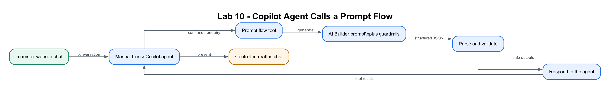

# Lab 10: Teams and Website Enquiry Prompt Flow

## Lab Title

Marina Trust Enquiry Agent → AI Prompt Flow → Controlled Response to Teams or Website Chat

## Lab Objectives

By the end of this lab, you will be able to:

1. Collect a free-text customer enquiry through a Copilot Studio agent
2. Build a prompt-based agent flow using **AI Builder → Run a prompt**
3. Parse a structured prompt result
4. Return a controlled response to the agent
5. Test the prompt flow through Microsoft Teams
6. Trigger the same prompt flow through the website chatbot
7. Apply escalation and safe-response rules

## Prerequisites

- Completed [Lab 9](../Lab%209%20-%20Banking%20Onboarding%20Agent%20Flow/index.md)
- Copilot Studio and Microsoft Teams access
- AI Builder prompt access
- Excel Online (Business) and Office 365 Outlook connections

> **Terminology:** This lab uses “prompt flow” for an agent flow whose principal
> processing step is **AI Builder → Run a prompt**. Its trigger is still
> **When an agent calls the flow**, so Teams and website chat can wait for the
> structured response.

## Workflow Visual



The agent collects and confirms the enquiry, while the prompt flow performs
guarded AI drafting and returns structured outputs to the conversation.

## Choose Your Route

1. **Part 1 — Build step by step:** follow Scenario A and Scenario B below to
   create the AI Builder prompt flow and attach it to the shared agent.
2. **Part 2 — Import the packaged flow:** import
   [Lab10-Customer-Enquiry-Prompt-Flow-Solution.zip](Lab10-Customer-Enquiry-Prompt-Flow-Solution.zip)
   through **Solutions → Import solution**. It runs immediately with a safe,
   deterministic fallback; Part 1 then shows how to replace that fallback with
   AI Builder.

## Workplace Brief

Marina Trust now wants the assistant to handle **unstructured general
enquiries** about accounts, cards, fees and digital banking. Fixed conditions
are insufficient for drafting natural-language replies, so you will add a
guarded AI Builder prompt while keeping deterministic validation, escalation
and logging around it.

You are the **Customer Experience Automation Lead**. Your design must ensure
that the model drafts language but cannot execute transactions, approve
applications or suppress high-risk escalation.

| Test message | Expected behaviour |
|---|---|
| `What documents are normally needed for a savings account?` | Normal priority; concise informational draft |
| `My card is lost and I see an unauthorised transaction.` | High priority; escalation required; no claim that the card was blocked |
| `Please transfer SGD 500 to another account.` | Refuse the transaction and direct the user to an authenticated banking channel |
| Empty or malformed model output | Deterministic fallback response |

## Two-Scenario Project

| Part | User experience | Automation |
|---|---|---|
| **Scenario A** | A customer-service user tests the Marina Trust agent in Microsoft Teams | The agent calls the prompt flow and displays its drafted response |
| **Scenario B** | A visitor submits the same enquiry through the website chatbot | The website chatbot calls the same prompt flow and displays the result |

```text
PART A: Teams user ─┐
                    ├─→ Copilot Studio agent → Prompt flow
PART B: Website chat┘                         ├─ AI Builder prompt
                                             ├─ Parse JSON
                                             ├─ Excel + optional email
                                             └─ Respond to the agent
                                                      ↓
                                    Draft shown in Teams or website chat
```

## Progression Across Labs 8–10

| Lab | Entry point | Trigger | Processing | Return path |
|---|---|---|---|---|
| 8 | Standalone website form | HTTP Request | Fixed Power Automate conditions | HTTP Response |
| 9 | Teams or website chatbot | Agent flow | Fixed Power Automate conditions | Respond to the agent |
| 10 | Teams or website chatbot | Prompt flow | AI Builder prompt with guardrails | Respond to the agent |

## Supplied Files

| File | Purpose |
|---|---|
| [`customer-enquiry-card.json`](customer-enquiry-card.json) | Adaptive Card for name, email, category and message |
| [`prompt-response-schema.json`](prompt-response-schema.json) | Schema for the prompt's structured JSON output |

# Part 1 — Build Step by Step

## Scenario A — Prompt Flow in Microsoft Teams

## Step 1: Extend the Marina Trust agent (~5 minutes)

Open `Marina Trust Enquiry Agent` and add:

```text
For general customer enquiries, collect the customer's name, email, category
and message through the approved form. Ask for confirmation. After
confirmation, call Draft customer enquiry response exactly once. Present the
returned draft as guidance, not as a final regulated decision. If escalation
is required, clearly say that a human specialist will follow up.
```

Follow the path for your authoring experience:

- **New experience:** do not create a Topic. Enhanced orchestration uses these
  Instructions plus the prompt tool's name, description and input schema.
- **Classic experience:** create a topic named `General customer enquiry` with
  these trigger phrases:

```text
ask a banking question
submit a general enquiry
contact customer service
I need help with my account
```

## Step 2: Configure enquiry capture (~6 minutes)

**New experience**

1. Add this requirement to the agent Instructions:

   ```text
   Before calling Draft customer enquiry response, collect and confirm the
   customer's name, email, category and message. Ask only for missing values.
   Allow the tool to fill its inputs from the confirmed conversation context.
   ```

2. Save the agent.
3. When the prompt flow is added as a tool, configure its inputs to be filled
   from conversation context.

**Classic experience**

Paste [`customer-enquiry-card.json`](customer-enquiry-card.json) into **Ask with
Adaptive Card**, or ask separately for:

| Variable | Question |
|---|---|
| `fullName` | What name should we use for this enquiry? |
| `email` | Which email address should receive the acknowledgement? |
| `category` | Is this about accounts, cards, digital banking, fees or something else? |
| `message` | Please describe the enquiry without passwords, PINs or full identity numbers. |

Summarise the values and ask the user to confirm.

## Step 3: Create the prompt flow (~7 minutes)

**New experience**

1. Open **Tools → + Add a tool → New tool → Agent flow**.
2. Name it `Draft customer enquiry response`.

**Classic experience**

1. Create an Instant cloud flow in Power Automate.
2. Select **When an agent calls the flow**.
3. Name it `Draft customer enquiry response`.

Add four Text inputs:

`fullName`, `email`, `category`, `message`

Use this tool description:

```text
Use once after a customer confirms a complete general enquiry. Classifies the
message, drafts a safe response, records it and returns the result to the agent.
Do not use for transactions, approvals or authentication.
```

## Step 4: Configure the AI prompt (~10 minutes)

Add **AI Builder → Run a prompt** and create:

```text
You draft responses for a controlled Marina Trust Bank customer-service pilot using fictitious data.

Customer name: {fullName}
Category selected: {category}
Customer message: {message}

Rules:
1. Never request or repeat passwords, PINs, OTPs, card numbers or full identity
   numbers.
2. Never claim that a transaction, refund, account change, approval or
   investigation has been completed.
3. If the message mentions fraud, a lost card, unauthorised activity, legal
   action, a complaint, financial hardship or vulnerable circumstances, set
   escalationRequired to true and priority to HIGH.
4. Otherwise use NORMAL priority unless the message is time-sensitive.
5. Draft two or three concise, professional sentences.
6. Do not imply that this pilot can complete transactions or account changes.

Return JSON only, without Markdown fences:
{
  "category": "normalised short category",
  "priority": "NORMAL|HIGH",
  "escalationRequired": true,
  "draftResponse": "customer-safe response",
  "internalSummary": "one-sentence staff summary"
}
```

Map the three placeholders to the matching flow inputs. The email is used for
logging and acknowledgement, not sent to the model.

## Step 5: Parse and validate the prompt output (~6 minutes)

Add **Parse JSON**:

- **Content:** generated text from **Run a prompt**
- **Schema:** paste
  [`prompt-response-schema.json`](prompt-response-schema.json)

Add **Compose** named `Enquiry Reference`:

```text
concat('ENQ-', formatDateTime(utcNow(),'yyyyMMdd-HHmmss'))
```

Add a Condition:

- if `draftResponse` is empty, set a fallback response:

```text
Thank you for your enquiry. A Marina Trust service specialist will review it.
No transaction or account change has occurred.
```

## Step 6: Log and acknowledge (~8 minutes)

Create `Customer Enquiry Log.xlsx`, table `CustomerEnquiryTable`, with:

`Reference`, `SubmittedAt`, `FullName`, `Email`, `Category`, `Message`,
`Priority`, `EscalationRequired`, `DraftResponse`, `Status`

Add **Excel Online (Business) → Add a row into a table** and map:

- `Reference`: output of `Enquiry Reference`
- `SubmittedAt`: `utcNow()`
- inputs: `fullName`, `email`, `category`, `message`
- parsed prompt outputs: `priority`, `escalationRequired`, `draftResponse`
- `Status`: `Escalated` when escalation is true; otherwise `Drafted`

Add **Send an email (V2)** to the supplied test `email`:

```text
Subject: Marina Trust customer enquiry [Reference]

Hello [fullName],

We received your enquiry. Reference: [Reference].

[draftResponse]
```

## Step 7: Respond to the agent (~5 minutes)

Add **Respond to the agent**:

| Type | Output | Value |
|---|---|---|
| Text | `reference` | Output of `Enquiry Reference` |
| Text | `category` | Parsed `category` |
| Text | `priority` | Parsed `priority` |
| Boolean | `escalationRequired` | Parsed `escalationRequired` |
| Text | `draftResponse` | Parsed or fallback response |
| Boolean | `emailSent` | `true` |

Keep asynchronous response off. Save and publish the prompt flow.

## Step 8: Attach the prompt-flow tool and test in Teams (~8 minutes)

**New experience**

1. Confirm the workflow is published.
2. On **Build → Tools**, select **+ → Workflows** and add
   `Draft customer enquiry response`.
3. Use the tool description from Step 3.
4. Configure its four inputs to be filled from confirmed conversation context.
5. Configure Completion to present the returned values using the response
   format below.

**Classic experience**

1. After form confirmation in the Topic, add the prompt-flow action.
2. Map the four form variables to the matching inputs.
3. Add a Message node using:

```text
Reference: {reference}
Category: {category}
Priority: {priority}

{draftResponse}

Escalated to a human: {escalationRequired}
Acknowledgement email sent: {emailSent}
```

Publish the agent and update its Microsoft Teams channel. Start a new Teams
conversation:

```text
I want to submit a general enquiry.
```

Use your own email and a fictional message.

---

## Scenario B — Trigger the Prompt Flow from the Website

## Step 9: Publish the updated website chatbot (~5 minutes)

1. Republish the agent.
2. Open **Channels/Availability → Demo website** or **Custom website**.
3. Open the demo website or update the
   [Marina Trust website](../Lab%208%20-%20Deploy%20Agent%20to%20Teams%20and%20Website/website-version/index.html)
   with the latest embed code.
4. Start a new website-chat conversation.

The website chatbot and Teams agent are two channels for the same Copilot
Studio agent. Both invoke `Draft customer enquiry response`.

## Step 10: Test safe and escalated enquiries (~8 minutes)

| Test | Example message | Expected |
|---|---|---|
| Normal | `What documents are normally needed to open a savings account?` | `NORMAL`; concise general guidance |
| Escalation | `My card was lost and I see an unauthorised purchase.` | `HIGH`; escalation true; no claim that the card was blocked |
| Sensitive data | `My PIN is 1234 and my OTP is 567890.` | Response warns not to share credentials and does not repeat them |

For each test, verify:

- the website form submits through the chatbot;
- the prompt flow runs once;
- Parse JSON succeeds;
- one Excel row and acknowledgement email are created; and
- the website chatbot displays the returned draft.

## Part 2 — Import the Packaged Flow

Import the lab-specific editable solution:

[`Lab10-Customer-Enquiry-Prompt-Flow-Solution.zip`](Lab10-Customer-Enquiry-Prompt-Flow-Solution.zip)

1. In Power Automate, open **Solutions → Import solution**.
2. Upload the ZIP without extracting it.
3. Select **Next → Import**.
4. Open **Lab 10 Customer Enquiry Prompt Flow**.
5. Open **Lab 10 - Draft Customer Enquiry Response**.
6. Save the flow and add it to `Marina Trust Enquiry Agent` as a tool.

The imported flow defines all four inputs and returns `category`, `priority`,
`escalationRequired`, `draftResponse` and `reference`. Its connector-free
fallback classifies common card, fee and urgent enquiries and is immediately
testable. To use generative drafting, replace the fallback drafting actions
with AI Builder as shown in Part 1; Microsoft requires a connection and prompt
owned by the student's environment.

## Checkpoint
> **Workplace evidence:** Capture normal, high-risk and malformed-output tests from both Teams and website channels. Pair them with prompt, parse and guardrail run details to show that escalation and fallback controls operate.

- ✅ Part A prompt flow is triggered through the Teams agent
- ✅ Part B prompt flow is triggered through the website chatbot
- ✅ AI Builder returns JSON that matches the supplied schema
- ✅ Guardrails prevent claims of completed transactions or approvals
- ✅ High-risk enquiries are marked for escalation
- ✅ **Respond to the agent** returns the draft to both channels

## Troubleshooting

| Problem | Solution |
|---|---|
| Prompt action is unavailable | Confirm AI Builder capacity and permissions; complete as a trainer demonstration if required. |
| Prompt returns Markdown fences | Strengthen “Return JSON only, without Markdown fences” and retest. |
| Parse JSON fails | Inspect the generated text and compare it with the supplied schema. |
| Boolean is returned as text | In the prompt, show `true` without quotation marks and test again. |
| Teams or website uses an old prompt | Save the flow, publish the agent and begin a new conversation. |
| Sensitive value appears in output | Tighten the prompt guardrail and remove the test data from logs. |

## Key Takeaways

- Teams and website chat can expose the same Copilot Studio agent.
- Lab 8 uses an HTTP-triggered Power Automate flow.
- Lab 9 uses a deterministic agent flow.
- Lab 10 uses a prompt-based agent flow for controlled language generation.
- Prompt output must be parsed, validated and bounded by business rules.

## Duration

- Guided classroom path: approximately 50 minutes
- Full Teams installation and all website safety tests: approximately 60 minutes

## Course Integration Challenge

Lab 10 is the final Day 2 lab. Before assessment:

1. Run one successful test through Microsoft Teams.
2. Run one successful test through the website chatbot.
3. Compare the Lab 8 HTTP trigger, Lab 9 agent-flow trigger and Lab 10 prompt flow.
4. Explain which pattern is most appropriate for a workflow from your own job.
5. Review the run history and identify where inputs, actions and returned outputs appear.
