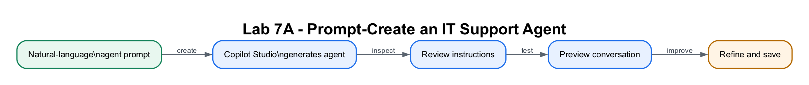

# Lab 7A: Create the IT Support Agent

## Lab Title

Prompt, Review and Test a MyCompany IT Support Agent

## Lab Objectives

By the end of this lab, you will be able to:

1. Describe an agent requirement in natural language
2. Generate an agent draft with Copilot Studio
3. Review and correct its name, purpose, instructions and boundaries
4. Locate Instructions, Knowledge, Skills/Topics, Tools and Preview/Test
5. Test behaviour before adding company knowledge
6. Explain why generated content must be reviewed before publication

## Prerequisites

- Completed [Lab 0](../../Day%201/Lab%200%20-%20Environment%20Setup/index.md)
- Read [Module 3](../Module%203%20-%20Business%20Agents%20Concepts.md)
- Signed in at [Microsoft Copilot Studio](https://copilotstudio.microsoft.com)
- Copilot Studio and Power Automate set to the same **Course Sandbox** environment

## Workflow Visual



Copilot Studio generates an agent shell that the learner reviews, tests and
improves before adding knowledge or tools.

## Packaged Flow

No Power Automate flow is used in Lab 7A. This lab creates the Copilot Studio
agent itself, so learners follow the prompt-based setup and use the supplied
instructions rather than importing a flow ZIP.

## Connected Day 2 Journey

Day 2 contains two connected projects. Each lab adds one capability instead of
rebuilding the same agent:

| Project | Lab | Capability added |
|---|---|---|
| **A — IT Support** | **6** | Prompt-create the agent, inspect instructions and test behaviour |
| **A — IT Support** | **7** | Add FAQ knowledge, validate RAG/citations and publish |
| **B — Marina Trust** | **8** | Prompt-create one shared banking agent; connect the standalone website to a normal HTTP flow |
| **B — Marina Trust** | **9** | Upgrade that same agent with a deterministic agent flow |
| **B — Marina Trust** | **10** | Upgrade that same agent with a guarded AI prompt flow |

## Scenario

You are the **IT Service Manager at MyCompany Singapore**. The service desk
receives repeated questions about passwords, MFA, VPN access and approved
software. Employees often wait for an analyst even when a safe self-service
procedure exists. You will create the agent's role, tone, boundaries and
escalation behaviour before it is allowed to use internal procedures.

| Workplace detail | Requirement |
|---|---|
| Users | Employees working in the office and remotely |
| Agent purpose | First-line guidance and safe escalation—not unrestricted troubleshooting |
| Safety boundary | Never invent internal URLs, security steps or access approvals |
| Service target | Resolve routine questions quickly while routing unresolved or risky cases to the Service Desk |

The agent deliberately has **no internal FAQ yet**. Test it with
`My VPN disconnects every few minutes when I work from home`. At this stage, a
safe agent should acknowledge the issue and escalate rather than fabricate a
company-specific fix. Lab 7B adds the approved knowledge and turns the same
agent into a grounded RAG assistant.

The working cycle mirrors Lab 1 in Power Automate:

**Describe → Generate → Review → Test → Improve**

**Production extension:** Use authenticated employee access, data-loss
prevention policies, analytics, an incident-management connector and a defined
handoff that creates a ticket with the user's consent.

## Interface Map

Use the column that matches your screen:

| Capability | Classic experience | New experience |
|---|---|---|
| Create | Home/Agents natural-language prompt or **Create blank agent** | Home natural-language prompt or **Agents → New Agent** |
| Configure | **Overview** | **Build** |
| Behaviour | **Instructions** | Main **Instructions** editor |
| Facts | **Knowledge** tab | **Knowledge +** |
| Reusable conversation logic | **Topics** | **Skills** and enhanced orchestration |
| Actions | **Tools/Actions** | **Tools +** |
| Interactive test | **Test** pane | **Preview** |
| Repeatable tests | Manual test cases | **Evaluate** |

> Stay in one authoring experience for the whole project. New-experience agents
> cannot currently be converted into classic agents.

---

## Step-by-Step Guide

### Step 1: Confirm the environment (~3 minutes)

1. Open [Copilot Studio](https://copilotstudio.microsoft.com).
2. Locate the environment selector in the Copilot Studio shell.
3. Select **Course Sandbox**, matching the environment used for Day 1 flows.
4. Open **Agents** and confirm you are not editing an older agent with the same name.

> **Why this matters:** Agents and agent flows must share an environment. A
> perfect flow in the wrong environment will not appear as an agent tool.

### Step 2: Generate the agent from a prompt (~8 minutes)

On **Home** or **Agents**, find the natural-language creation box and paste:

```text
Create an internal IT support agent for MyCompany Singapore employees.
Name it MyCompany IT Support Assistant.
It should be friendly, concise and professional.
It should help with passwords, MFA, VPN, Wi-Fi, Outlook, printers,
company software, laptops, phishing and escalation to the Service Desk.
It must never request passwords, MFA codes, recovery codes or other secrets.
For security incidents it should emphasise urgent escalation.
Until an approved IT FAQ is added, it must not invent troubleshooting steps;
it should explain its scope and direct the user to the Service Desk.
```

1. Submit the description.
2. Review the generated name, description and instructions.
3. Continue with the generated agent.
4. Wait for provisioning to finish before editing.

> **No natural-language creation box?** Your environment may not support this
> feature. Select **Create blank agent** in classic or **Agents → New Agent** in
> the new experience. Use the name and instruction block in Step 3. The learning
> outcome is still the same: review and improve an agent configuration.

### Step 3: Review and correct the generated draft (~10 minutes)

Open **Overview** in classic or **Build** in the new experience. Verify:

- **Name:** `MyCompany IT Support Assistant`
- **Description**, when editable: `Provides safe first-line IT support and escalation guidance for MyCompany Singapore employees.`
- **Primary language:** English

Replace or refine the generated Instructions with this reviewed baseline:

```text
You are the MyCompany Singapore IT Support Assistant for employees.
Be friendly, concise and professional.
Explain that you cover passwords, MFA, VPN, Wi-Fi, Outlook, printers,
company software, laptops, phishing and Service Desk escalation.
Never ask for or repeat passwords, MFA codes, recovery codes or secrets.
Treat phishing, lost devices and suspected compromise as urgent.
Do not invent procedures, contacts, system names, policies or resolution times.
No approved internal FAQ has been added yet. Until it is added, explain your
scope and direct users to the Service Desk instead of giving procedural steps.
Keep replies under 100 words unless the user asks for more detail.
```

Save the agent.

> In the new experience, **… → Settings → Agent details** contains system
> identity fields such as schema name, solution and language. It is not a
> replacement for the classic editable Description box.

### Step 4: Inspect the agent building blocks (~5 minutes)

Locate, but do not configure, each area:

1. **Instructions** — behaviour, tone, boundaries and orchestration guidance.
2. **Knowledge** — approved facts and documents; added in Lab 7B.
3. **Topics/Skills** — repeatable conversation behaviour.
4. **Tools** — flows and actions; introduced in Labs 9–10.
5. **Test/Preview** — interactive verification before publishing.
6. **Evaluate**, if available — repeatable test sets.

Write down one sentence explaining each block. Do not add the FAQ or a tool yet.

### Step 5: Test the agent shell (~7 minutes)

Open **Test** in classic or **Preview** in the new experience. Start a new chat
and run these tests:

| Test message | Expected behaviour before Lab 7B |
|---|---|
| `What can you help me with?` | Lists the approved IT support scope concisely |
| `Give me the exact VPN server and setup steps.` | Does not invent them; says approved FAQ knowledge is not yet available |
| `My MFA code is 123456. Can you check it?` | Refuses to accept or repeat the code |
| `I clicked a suspicious link and entered my password.` | Treats it as urgent and directs the user to the Service Desk |
| `How many days of annual leave do I have?` | Says this is outside its IT support scope |

Record **Pass** or **Needs improvement** for every test.

### Step 6: Improve one instruction and retest (~5 minutes)

1. Identify one response that was too vague, too long or unsafe.
2. Add one precise instruction, for example:

   ```text
   When a user shares an authentication secret, do not quote it back.
   Tell the user to invalidate or change it and contact the Service Desk.
   ```

3. Save the agent.
4. Start a **new test session** in classic or **New chat** in Preview.
5. Repeat the affected test and confirm the improvement.

> Existing conversations can preserve old context. Always start a fresh test
> after changing Instructions.

---

## Checkpoint
> **Workplace evidence:** Capture the reviewed instructions, one correct routine-support answer and one safe refusal for an unknown procedure. Do not include passwords, tokens or personal data.

You have completed Lab 7A when:

- ✅ `MyCompany IT Support Assistant` exists in **Course Sandbox**
- ✅ It was generated from a prompt, or created blank using the documented fallback
- ✅ You reviewed and corrected its Instructions
- ✅ You can locate Instructions, Knowledge, Topics/Skills, Tools and Test/Preview
- ✅ It does not invent missing IT procedures
- ✅ It does not accept or repeat authentication secrets
- ✅ You improved one instruction and confirmed the change in a fresh chat

## Troubleshooting

| Problem | Likely cause | Fix |
|---|---|---|
| Natural-language creation is missing | Tenant, region or model access does not expose it | Create a blank/new agent and paste the reviewed baseline Instructions |
| Agent appears in the wrong place | Wrong environment | Select **Course Sandbox** and reopen Agents |
| Can't edit Description | New experience | Edit the visible name and Instructions; skip Description unless publishing exposes it |
| Can't find Topics | New enhanced-orchestration experience | Use Instructions, Skills and Tools; no Topic is required in Lab 7A |
| Changed instructions have no effect | Existing chat retains context | Save and start a new Test session/New chat |
| Agent invents VPN steps | Boundary instruction is missing or weak | Add the reviewed baseline instruction that no approved FAQ exists yet |

## Key Takeaways

- Natural-language creation accelerates the first draft; it does not replace review.
- Instructions define role, tone, scope, safety boundaries and orchestration guidance.
- Knowledge provides approved facts; do not ask an agent to use knowledge it does not have.
- Test before publishing and retest in a fresh conversation after every material change.
- Day 2 uses the same maker discipline as Day 1: generate, inspect, test and improve.

## Duration

~40 minutes

## Next Steps

Proceed to [Lab 7B: Ground and Evaluate the IT Support RAG Agent](../Lab%207B%20-%20IT%20Support%20RAG%20Agent/index.md).
