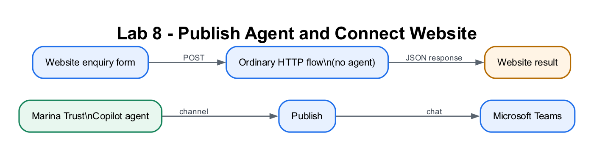

# Lab 8: Deploy the Agent to Teams and a Website

## Lab Title

Publish the Shared Copilot Agent to Teams and Connect the Standalone Website

## Lab Objectives

By the end of this lab, you will be able to:

1. Create the shared Marina Trust agent from a natural-language prompt
2. Review its Instructions and publish it to Microsoft Teams
3. Use the supplied Marina Trust website as an external enquiry form
4. Receive website data with **When an HTTP request is received**
5. Apply deterministic Power Automate conditions without an AI decision
6. Log and email the result
7. Return JSON for the website to display
8. Explain why the website flow is not an agent flow

## Prerequisites

- Completed [Lab 7B](../Lab%207B%20-%20IT%20Support%20RAG%20Agent/index.md)
- Copilot Studio and Microsoft Teams access
- Power Automate access to the premium **Request** connector
- Excel Online (Business) and Office 365 Outlook connections
- Python 3 or another static-file server

> **Licensing note:** If **When an HTTP request is received** or the Teams
> channel is unavailable, complete that section as a trainer demonstration.

## Workflow Visual



The standalone website calls an ordinary Power Automate automation; no agent
participates in the submission path.

## Choose Your Route

1. **Part 1 — Build step by step:** follow Scenario A and Scenario B below to
   create the agent and every Power Automate card manually.
2. **Part 2 — Import the packaged flow:** import
   [Lab8-Marina-Trust-Website-Enquiry.zip](Lab8-Marina-Trust-Website-Enquiry.zip),
   bind Excel and Outlook, select your workbook/table, save, and test. The ZIP
   is stored in this lab folder.

## Workplace Brief

You are a **Digital Onboarding Analyst at Marina Trust Bank** supporting a
controlled pilot for new-account enquiries. Operations wants the same
eligibility rules applied consistently, but the architecture team first needs a
baseline showing what ordinary Power Automate can do without an agent.

| Stakeholder | Operational need |
|---|---|
| Branch and contact-centre staff | Explain published account criteria in Teams without collecting identity data |
| Prospective customer | Submit a structured website application and receive an immediate reference |
| Compliance | Route PEP and foreign-tax-resident cases for human review |
| Operations | Log the application, send a safe summary and retain decision evidence |

Use fictitious data only. The pass condition is that the website result, flow
run, Excel row and email all show the same application ID and decision.

## Two-Scenario Project

This lab begins **Project B**. Keep the `Marina Trust Enquiry Agent` created
here; Labs 9 and 10 upgrade this exact agent rather than creating another one.

Marina Trust Bank wants two entry points:

| Part | User experience | Automation |
|---|---|---|
| **Scenario A** | Staff use an informational Copilot agent in Microsoft Teams | The agent explains the published account criteria; it does not submit the website form |
| **Scenario B** | A customer submits the supplied website enquiry form | The website directly triggers an ordinary Power Automate HTTP flow |

```text
PART A — INTERNAL
Staff → Microsoft Teams → Marina Trust Enquiry Agent
                           └── explains criteria and directs staff to the website

PART B — EXTERNAL
Website form → HTTP POST → Power Automate cloud flow
                            ├── deterministic conditions
                            ├── Excel row
                            ├── confirmation email
                            └── HTTP Response → website result card
```

> **Architecture checkpoint:** The Part B website does not call Copilot Studio.
> The HTTP trigger starts a normal Power Automate cloud flow.

## Supplied Website

Use the files in `website-version`:

| File | Purpose |
|---|---|
| [`index.html`](website-version/index.html) | Bank landing page, criteria table, form and result panel |
| [`style.css`](website-version/style.css) | Responsive banking interface |
| [`script.js`](website-version/script.js) | Validation, HTTP POST and response rendering |
| [`request-schema.json`](website-version/request-schema.json) | Incoming website payload schema |
| [`flow-response-schema.json`](website-version/flow-response-schema.json) | JSON returned by Power Automate |
| [`sample-response.json`](website-version/sample-response.json) | Example browser response |

---

# Part 1 — Build Step by Step

## Scenario A — Copilot Agent in Microsoft Teams

## Step 1: Prompt-create the shared agent (~8 minutes)

1. Open Copilot Studio.
2. Confirm **Course Sandbox** is selected.
3. On Home or Agents, paste this natural-language creation prompt:

```text
Create an agent named Marina Trust Enquiry Agent for a controlled pilot.
It helps staff explain published account enquiry criteria and directs users
to the approved website form. It must not collect NRIC, date of birth or other
identity details in chat. It must not claim to submit, approve or reject a real
application. It should be concise and state that the pilot uses fictitious data.
```

4. Continue with the generated agent. If natural-language creation is not
   available, create a blank/new agent named `Marina Trust Enquiry Agent`.
5. Review the generated name, description and Instructions.
6. Replace or refine the Instructions with:

```text
You are the Marina Trust Enquiry Agent for a controlled pilot using fictitious data.
Explain the published account criteria clearly and concisely.
Use these fictitious minimum deposits: Savings SGD 500; Joint Savings SGD
1,000; Student Account SGD 0; Current SGD 3,000; Fixed Deposit SGD 10,000;
Multi-Currency SGD 5,000.
Fixed Deposit requires annual income of at least SGD 30,000.
Do not collect NRIC, date of birth or other identity details in chat.
Do not claim to submit, approve or reject an application.
Direct users who want to submit an enquiry to the Marina Trust website form.
When users ask whether a real account has been opened, explain that the pilot only demonstrates the onboarding process.
```

7. Save and test:

```text
What is the minimum deposit for a savings account?
Can you submit my application here?
```

The second answer should direct the user to the website rather than claiming
that the agent can submit the form.

> **Continuity checkpoint:** Do not delete this agent after Lab 8. Lab 9 adds a
> deterministic tool to it, and Lab 10 adds a guarded AI prompt tool.

## Step 2: Publish the agent to Teams (~6 minutes)

**New experience**

1. Select **Publish** and publish the latest agent content.
2. Open **Channels** or **Availability**.
3. Select **Microsoft Teams**.
4. Select **Add channel** or **Make agent available**.
5. Open the installation link and add the agent to Teams.

**Classic experience**

1. Select **Publish → Publish latest content**.
2. Open **Manage → Channels → Microsoft Teams**.
3. Enable Teams and select **Open agent** or **Add to Teams**.

If tenant approval is required, use Copilot Studio **Preview/Test** as the
fallback and record the admin dependency.

## Step 3: Test in Teams (~4 minutes)

Ask:

```text
Where do I submit an enquiry?
Can you approve a current account application?
```

Confirm that the agent:

- points to the approved website form;
- does not collect sensitive identity details; and
- does not say that it triggered a flow.

---

## Scenario B — Website Triggers a Power Automate Flow

> **Imported-flow path:** If you imported the starter ZIP, complete Step 4,
> reconnect the Excel action, save the flow and continue at Step 10. You do not
> need to recreate Steps 5–9 manually.

## Step 4: Prepare the Excel log (~5 minutes)

Create `Retail Banking Onboarding.xlsx` in OneDrive for Business with table
`OnboardingTable` and these headers:

`ApplicationId`, `SubmittedAt`, `FullName`, `NRIC`, `Email`,
`AccountType`, `Decision`, `Reason`, `RiskFlags`

Save and close the workbook.

## Step 5: Create the HTTP flow (~8 minutes)

1. Open [Power Automate](https://make.powerautomate.com).
2. Select **Create → Automated cloud flow**.
3. Name it `Marina Trust Website Enquiry`.
4. Select the **Request** trigger **When an HTTP request is received**.
   - Do not select the outbound **HTTP** action.
   - Do not select **HTTP Webhook**.
5. For this isolated classroom exercise, set **Who can trigger the flow?** to
   **Anyone**.
6. Leave the request schema empty.
7. Add **Compose**, rename it `Application JSON`, and use:

```text
json(triggerBody())
```

8. Add **Parse JSON**:
   - **Content:** Outputs from `Application JSON`
   - **Schema:** paste [`request-schema.json`](website-version/request-schema.json)

The website sends JSON as `text/plain` so a browser can make a simple request
without a CORS preflight. The Compose expression converts it back to an object.

## Step 6: Initialise the result (~5 minutes)

Add:

| Action | Name | Type | Initial value |
|---|---|---|---|
| Initialize variable | `Decision` | String | `APPROVED` |
| Initialize variable | `Reason` | String | `The application meets the selected account criteria.` |
| Initialize variable | `RiskFlags` | String | Leave empty |

Add **Compose** named `Application ID`:

```text
concat('APP-', formatDateTime(utcNow(),'yyyyMMdd-HHmmss'))
```

## Step 7: Apply deterministic rules (~12 minutes)

Build conditions in this order and use **Set variable** when a rule matches:

| Priority | Condition | Result |
|---|---|---|
| 1 | `nric` equals `S8412345D` | `DUPLICATE`; a fictitious existing customer record uses this test identity |
| 2 | Applicant is under 18 | `REJECTED`; applicant must be at least 18; flag `MINOR` |
| 3 | `pep` equals `Yes` | `REVIEW`; enhanced due diligence; flag `PEP` |
| 4 | `foreignTaxResident` equals `Yes` | `REVIEW`; tax-residency review; flag `CRS_FATCA` |
| 5 | Deposit is below the account minimum | `REJECTED`; minimum deposit not met |
| 6 | Current account and `Unemployed` | `REJECTED`; employment criterion not met |
| 7 | Fixed Deposit and income below `30000` | `REJECTED`; income criterion not met |
| Default | No rule matched | Keep `APPROVED` |

Age expression:

```text
greater(
  ticks(addToTime(body('Parse_JSON')?['dateOfBirth'],18,'Year')),
  ticks(utcNow())
)
```

Deposit minimums:

| Account | Minimum |
|---|---:|
| Savings | 500 |
| Joint Savings | 1000 |
| Student Account | 0 |
| Current | 3000 |
| Fixed Deposit | 10000 |
| Multi-Currency | 5000 |

> Do not add **Run an agent**, **Execute Agent**, AI Builder or a Copilot
> Studio connector. Lab 8 is the no-agent baseline.

## Step 8: Log and email (~8 minutes)

Add **Excel Online (Business) → Add a row into a table** and map the parsed form
values, `Application ID`, `Decision`, `Reason` and `RiskFlags`.

Add **Send an email (V2)**:

- **To:** parsed `email`
- **Subject:** `Marina Trust onboarding enquiry ` + `Application ID`
- **Body:** include the reference, account type, decision and reason

Use your own email address during testing. Do not include the complete NRIC,
date of birth or address in the email.

## Step 9: Return JSON to the website (~5 minutes)

Add the built-in **Response** action:

- **Status code:** `200`
- **Header:** `Access-Control-Allow-Origin` = `*`
- **Body:**

```json
{
  "applicationId": "@{outputs('Application_ID')}",
  "decision": "@{variables('Decision')}",
  "reason": "@{variables('Reason')}",
  "riskFlags": "@{if(empty(variables('RiskFlags')),json('[]'),createArray(variables('RiskFlags')))}",
  "emailSent": true
}
```

Save the flow. Copy the generated HTTP POST URL from the trigger, but never
commit that URL to source control.

## Step 10: Run and test the website (~8 minutes)

```bash
cd "labs/Day 2/Lab 8 - Deploy Agent to Teams and Website/website-version"
python3 -m http.server 8000
```

1. Open `http://localhost:8000`.
2. Paste the HTTP POST URL into **Lab configuration**.
3. Select a supplied test case.
4. Replace the email with your own test address.
5. Submit the form.

Verify:

| Test | Expected |
|---|---|
| Happy path | `APPROVED` |
| Fictitious duplicate identity | `DUPLICATE` |
| Under 18 | `REJECTED` with `MINOR` |
| PEP | `REVIEW` with `PEP` |

For each run, check the website result, flow run history, Excel row and email.

**Production extension:** Put the HTTP endpoint behind authenticated API
management, encrypt sensitive fields, replace Excel with Dataverse, obtain
consent, perform approved KYC/AML checks and require a compliance officer to
make any regulated decision. The classroom rules are process simulations, not
real eligibility or regulatory advice.

## Part 2 — Import the Packaged Flow

Download
[Lab8-Marina-Trust-Website-Enquiry.zip](Lab8-Marina-Trust-Website-Enquiry.zip)
and import it through **Power Automate → My flows → Import → Import Package
(Legacy)**.

1. For the flow row, choose **Create as new**.
2. Map the **Excel Online (Business)** and **Office 365 Outlook** connections.
3. Select **Import**, then open the imported flow.
4. In **Add a row into a table**, select your own
   `Retail Banking Onboarding.xlsx` and `OnboardingTable`.
5. Save the flow once to generate the HTTP POST URL.
6. Continue at [Step 10](#step-10-run-and-test-the-website-8-minutes).

The imported flow already contains the request parser, deterministic rule
expressions, Excel mapping, confirmation email and JSON Response. Microsoft
still requires connection sign-in and selection of tenant-owned resources.

## Checkpoint
> **Workplace evidence:** Retain the Teams informational test plus a website submission, returned decision, matching email, Excel record and successful Power Automate run. The flow must contain no AI action.

- ✅ Part A agent is published or previewed as a Teams agent
- ✅ Part A agent remains informational and does not submit the form
- ✅ Part B website directly triggers the ordinary HTTP cloud flow
- ✅ Deterministic Power Automate conditions determine the result
- ✅ Excel and email actions complete
- ✅ The Response action returns JSON to the website
- ✅ No agent or AI action exists in the Part B flow

## Troubleshooting

| Problem | Solution |
|---|---|
| Teams channel is unavailable | Publish and test in Copilot Studio Preview; ask the tenant administrator about Teams channel permissions. |
| HTTP URL is not shown | Save the flow after configuring the Request trigger. |
| Trigger asks for Subscribe URI | You selected **HTTP Webhook**; replace it with **When an HTTP request is received**. |
| `Failed to fetch` | Confirm the flow is enabled and the website contains the current HTTP URL. |
| Everyone is approved | Check the condition order and each matching branch's **Set variable** actions. |
| Excel is unauthorized | Reconnect Excel Online (Business) with an account that can edit the workbook. |

## Security Debrief

1. How should the classroom HTTP URL be protected in production?
2. Why should `Access-Control-Allow-Origin: *` be replaced with the exact site origin?
3. Why must the flow validate values already checked by the browser?
4. Which identity fields should be masked, encrypted or excluded?

## Duration

- Guided classroom path: approximately 40 minutes
- Full Teams installation, all test cases and security debrief: approximately 60 minutes

## Next Steps

Proceed to [Lab 9: Teams and Website Enquiry Agent Flow](../Lab%209%20-%20Banking%20Onboarding%20Agent%20Flow/index.md). Both Teams and the website chatbot will invoke a deterministic agent flow and display its returned result.
