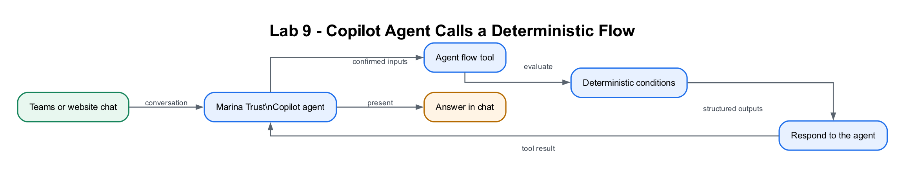

# Lab 9: Teams and Website Enquiry Agent Flow

## Lab Title

Marina Trust Enquiry Agent → Deterministic Agent Flow → Response to Teams or Website Chat

## Lab Objectives

By the end of this lab, you will be able to:

1. Collect a structured enquiry inside a Copilot Studio agent
2. Trigger **When an agent calls the flow**
3. Apply deterministic business rules in an agent flow
4. Return structured outputs with **Respond to the agent**
5. Test the agent in Microsoft Teams
6. Publish the same agent to a website channel
7. Compare an agent flow with Lab 8's ordinary HTTP flow

## Prerequisites

- Completed [Lab 8](../Lab%208%20-%20Deploy%20Agent%20to%20Teams%20and%20Website/index.md)
- Copilot Studio and Microsoft Teams access
- Excel Online (Business) and Office 365 Outlook connections
- `Retail Banking Onboarding.xlsx` and `OnboardingTable`

## Workflow Visual



The Copilot Studio agent orchestrates the conversation and calls the imported
Power Automate agent flow as a tool.

## Choose Your Route

1. **Part 1 — Build step by step:** follow Scenario A and Scenario B below to
   build the deterministic agent flow and attach it to the shared agent.
2. **Part 2 — Import the packaged flow:** import
   [Lab9-Banking-Onboarding-Agent-Flow-Solution.zip](Lab9-Banking-Onboarding-Agent-Flow-Solution.zip)
   through **Solutions → Import solution**. The connector-free decision flow is
   complete and stored in this lab folder.

## Workplace Brief

The Lab 8 pilot proved the rules, but customers still had to move between a
Teams explanation and a separate website form. As the **Conversational
Automation Developer**, you will let the Marina Trust agent collect and confirm
the non-sensitive onboarding fields, call a deterministic Power Automate tool
once, and present the returned decision in either Teams or website chat.

| Control | Why it matters |
|---|---|
| Ask only for missing values | Reduces customer effort |
| Summarise and confirm before calling | Prevents the agent from acting on misunderstood data |
| Call the tool exactly once | Avoids duplicate applications and duplicate emails |
| Display only returned values | Keeps the deterministic flow—not the language model—as the decision authority |

## Two-Scenario Project

| Part | User experience | Automation |
|---|---|---|
| **Scenario A** | A user opens the Marina Trust agent in Microsoft Teams and submits the enquiry form | The agent calls a deterministic agent flow and shows its returned values |
| **Scenario B** | A user opens the same agent on a website and submits the same form | The website chatbot calls the same agent flow and shows the response in chat |

```text
PART A: Teams user ─┐
                    ├─→ Copilot Studio agent → Agent flow
PART B: Website chat┘                         ├─ conditions
                                             ├─ Excel + email
                                             └─ Respond to the agent
                                                      ↓
                                          Result shown in Teams or website chat
```

## Lab 8 versus Lab 9

| Component | Lab 8 | Lab 9 |
|---|---|---|
| Website interface | Standalone HTML form | Embedded Copilot Studio chatbot |
| Trigger | When an HTTP request is received | When an agent calls the flow |
| Decision | Power Automate conditions | Power Automate conditions |
| Response | HTTP Response action | Respond to the agent |
| Copilot agent | Informational only | Collects data, calls flow and displays outputs |

## Supplied File

[`onboarding-enquiry-card.json`](onboarding-enquiry-card.json) contains the
Adaptive Card enquiry form.

# Part 1 — Build Step by Step

## Scenario A — Agent Flow in Microsoft Teams

## Step 1: Upgrade the Lab 8 agent (~5 minutes)

1. Open Copilot Studio.
2. Open the existing `Marina Trust Enquiry Agent` created and published in Lab 8. Do not create a second agent.
3. Add these instructions:

```text
Collect the fictitious onboarding enquiry through the approved form.
Summarise non-sensitive values and ask for confirmation.
After confirmation, call Assess onboarding enquiry exactly once.
Show only the values returned by the flow.
Never say a real bank account has been opened.
```

4. Follow the path for your authoring experience:
   - **New experience:** do not create a Topic. Enhanced orchestration uses the
     agent Instructions and the tool's name, description, inputs and outputs.
   - **Classic experience:** create a topic named
     `Banking onboarding enquiry` and add these trigger phrases:

```text
open a bank account
submit an onboarding enquiry
start an account application
banking enquiry form
```

## Step 2: Configure structured capture (~8 minutes)

**New experience**

1. Add this requirement to the agent Instructions:

   ```text
   Before calling Assess onboarding enquiry, collect and confirm fullName,
   email, accountType, employmentStatus, annualIncome, initialDeposit, pep and
   foreignTaxResident. Ask only for missing values. Do not collect NRIC or date
   of birth in chat. After confirmation, allow the tool to fill its inputs from
   the conversation context.
   ```

2. Save the agent.
3. When the tool is added in Step 3, configure each input to be filled from the
   conversation context. The new experience does not require an explicit Topic
   or Adaptive Card for conversational tool use.

**Classic experience**

In the `Banking onboarding enquiry` topic, paste
[`onboarding-enquiry-card.json`](onboarding-enquiry-card.json) into **Ask with
Adaptive Card**, or add one **Ask a question** node for each field:

`fullName`, `email`, `accountType`, `employmentStatus`, `annualIncome`,
`initialDeposit`, `pep`, `foreignTaxResident`

Ask for confirmation before calling the flow.

> **Why the paths differ:** Classic agents use explicit Topic nodes and
> variables. The new experience uses enhanced orchestration to extract tool
> inputs from the conversation using the tool description and Instructions.

## Step 3: Create the deterministic agent flow (~8 minutes)

**New experience**

1. Under **Tools**, select **+ Add a tool**.
2. Select **New tool → Agent flow**.
3. Name it `Assess onboarding enquiry`.

**Classic experience**

1. Create an Instant cloud flow in Power Automate.
2. Select **When an agent calls the flow**.
   - It may appear as **When Power Virtual Agents calls a flow**.
3. Name it `Assess onboarding enquiry`.

Add:

| Type | Input |
|---|---|
| Text | `fullName` |
| Text | `email` |
| Text | `accountType` |
| Text | `employmentStatus` |
| Number | `annualIncome` |
| Number | `initialDeposit` |
| Text | `pep` |
| Text | `foreignTaxResident` |

## Step 4: Apply the Power Automate rules (~10 minutes)

Initialise:

| Variable | Initial value |
|---|---|
| `Decision` | `APPROVED` |
| `Reason` | `The onboarding enquiry meets the selected account criteria.` |
| `RiskFlags` | blank |

Add `Application ID`:

```text
concat('AGENT-', formatDateTime(utcNow(),'yyyyMMdd-HHmmss'))
```

Apply these conditions in order:

1. `pep` is `Yes` → `REVIEW`, enhanced due diligence, `PEP`
2. `foreignTaxResident` is `Yes` → `REVIEW`, tax-residency review, `CRS_FATCA`
3. Deposit below the selected account minimum → `REJECTED`
4. Current account and `Unemployed` → `REJECTED`
5. Fixed Deposit and income below `30000` → `REJECTED`
6. Otherwise keep `APPROVED`

> Lab 9 intentionally uses no AI Builder prompt. The agent starts the flow, but
> Power Automate conditions still make the decision.

## Step 5: Log, email and respond (~10 minutes)

Add an Excel row using the flow inputs and result variables. Set NRIC to
`Not collected in chatbot`.

Add **Send an email (V2)** to the supplied `email` with the reference, account
type, decision and reason.

Add **Respond to the agent**:

| Type | Output | Value |
|---|---|---|
| Text | `applicationId` | Output of `Application ID` |
| Text | `decision` | `Decision` |
| Text | `reason` | `Reason` |
| Text | `riskFlags` | `RiskFlags` |
| Boolean | `emailSent` | `true` |

Keep asynchronous response off. Save and publish the flow.

## Step 6: Attach and configure the agent flow tool (~6 minutes)

**New experience**

1. Confirm the workflow is published.
2. On **Build → Tools**, select **+ → Workflows** and add
   `Assess onboarding enquiry`.
3. Give it a precise description: `Use once after the user confirms a complete
   fictitious onboarding enquiry. Apply fixed pilot rules, log the enquiry,
   send acknowledgement and return the result.`
4. Configure each input to be filled from the confirmed conversation context.
5. Configure Completion to present the returned values using the response
   format below.

**Classic experience**

1. After the form confirmation in the Topic, add **Call an action** and select
   `Assess onboarding enquiry`.
2. Map every form variable to the matching input.
3. Store all returned outputs.
4. Add a Message node using:

```text
Your onboarding enquiry has been processed.

Reference: {applicationId}
Decision: {decision}
Reason: {reason}
Risk flags: {riskFlags}
Confirmation email sent: {emailSent}
```

Save and publish the agent.

## Step 7: Publish and test in Teams (~6 minutes)

1. Open **Channels/Availability → Microsoft Teams**.
2. Add or update the Teams channel.
3. Install the agent in Teams.
4. Enter:

```text
I want to submit an onboarding enquiry.
```

Confirm that Teams displays the returned reference, decision and reason.

---

## Scenario B — Trigger the Same Agent Flow from a Website

## Step 8: Add the website channel (~6 minutes)

1. In Copilot Studio, open **Channels/Availability**.
2. Select **Demo website** or **Custom website**.
3. Publish the latest agent content.
4. Use one of these options:
   - open the Microsoft-hosted demo website; or
   - copy the supplied website embed code into the
     [Marina Trust site](../Lab%208%20-%20Deploy%20Agent%20to%20Teams%20and%20Website/website-version/index.html).

For a custom website, use only the embed code generated by your environment.
Do not paste another learner's agent identifier.

> The website does not call the agent-flow URL directly. The embedded chatbot
> receives the message, and the agent invokes **When an agent calls the flow**.

## Step 9: Test from the website (~8 minutes)

Open the website chatbot and enter:

```text
Start an account application.
```

Test:

| Case | Account | Income | Deposit | PEP | Foreign tax | Expected |
|---|---|---:|---:|---|---|---|
| 1 | Savings | 48000 | 1000 | No | No | `APPROVED` |
| 2 | Fixed Deposit | 12000 | 10000 | No | No | `REJECTED` |
| 3 | Savings | 90000 | 20000 | Yes | No | `REVIEW` |

Verify:

- the form appears in the website chatbot;
- one agent-flow run occurs after confirmation;
- one Excel row and one email are created; and
- the returned values appear inside the website chat.

## Part 2 — Import the Packaged Flow

To avoid building the trigger, decision expressions and response contract from
a blank canvas, import this lab-specific editable solution:

[`Lab9-Banking-Onboarding-Agent-Flow-Solution.zip`](Lab9-Banking-Onboarding-Agent-Flow-Solution.zip)

1. In Power Automate, open **Solutions → Import solution**.
2. Upload the ZIP without extracting it.
3. Select **Next → Import**.
4. Open **Lab 9 Banking Onboarding Agent Flow**.
5. Open **Lab 9 - Assess Banking Onboarding Enquiry**.
6. Save the flow and add it to `Marina Trust Enquiry Agent` as a tool.

The imported flow has all eight inputs, deterministic decision expressions,
`decision`, `responseMessage` and `reference` outputs. It uses no connector, so
it can be saved and tested immediately. Excel logging and email are optional
extensions because they require tenant-owned connections.

## Checkpoint
> **Workplace evidence:** Save one Teams transcript and one website transcript that call the same agent flow and return the same structured outcome. Include the flow output but redact customer identifiers.

- ✅ Part A agent works in Microsoft Teams
- ✅ Part B uses the same agent through a website channel
- ✅ Both channels trigger **When an agent calls the flow**
- ✅ Deterministic Power Automate conditions determine the result
- ✅ **Respond to the agent** returns structured values
- ✅ Teams and website chat display the returned result
- ✅ No HTTP Request trigger or AI Builder prompt is used in Lab 9

## Troubleshooting

| Problem | Solution |
|---|---|
| Agent flow does not appear | Confirm the agent trigger and response are in the same environment as the agent. |
| Adaptive Card does not save values | Confirm every input `id` matches the topic variable. |
| Teams shows old behavior | Publish the latest content and start a new conversation. |
| Website shows old behavior | Republish the agent and refresh the demo/custom website. |
| Chatbot responds before the flow finishes | Keep asynchronous response off. |
| Duplicate rows or emails | Call the agent flow once, only after confirmation. |

## Duration

- Guided classroom path: approximately 45 minutes
- Full Teams installation and website-channel testing: approximately 60 minutes

## Next Steps

Proceed to [Lab 10: Teams and Website Prompt Flow](../Lab%2010%20-%20Procurement%20Request%20Workflow/index.md), where an AI prompt generates a controlled customer response and returns it to the same channels.
